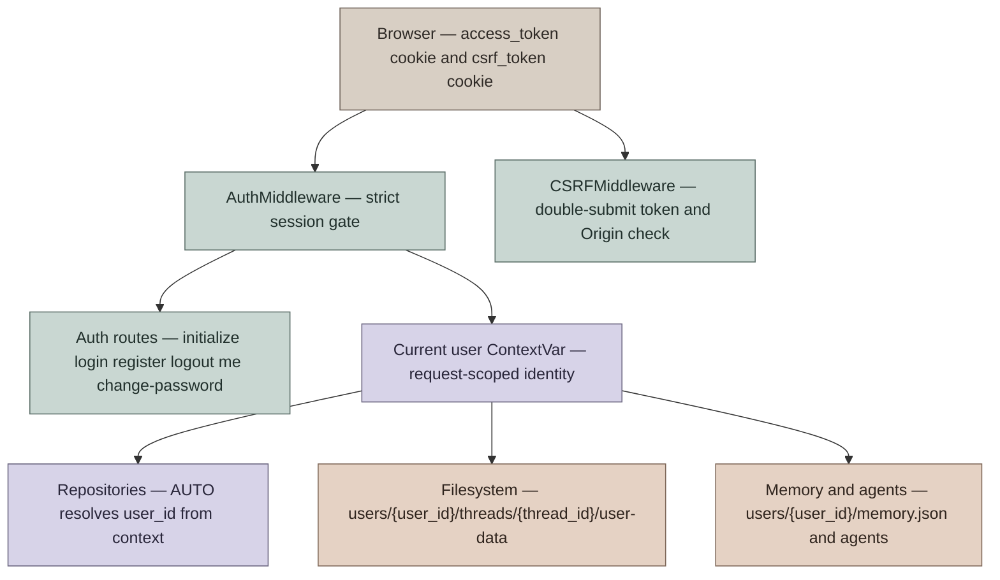
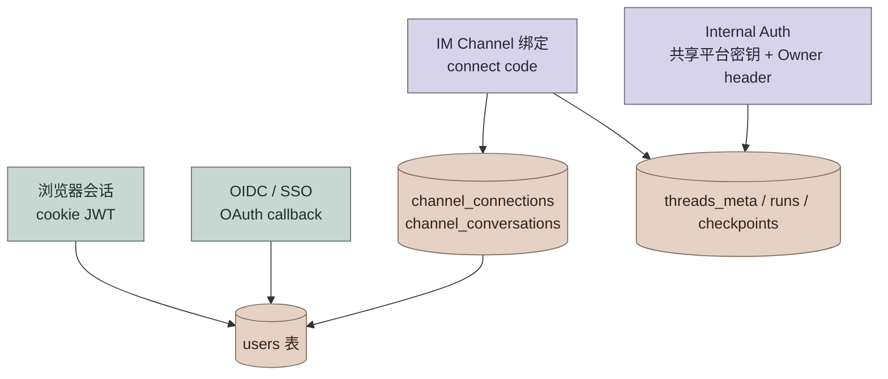

# 用户认证与隔离设计

本文档描述 DeerFlow 当前内置认证模块的设计，而不是历史 RFC。它覆盖浏览器登录、OIDC/SSO、平台信任接入（IM Channel 与 Internal Auth）、API 认证、CSRF、用户隔离、首次初始化、密码重置和升级迁移。

## 设计目标

认证模块的核心目标是把 DeerFlow 从“本地单用户工具”提升为“可多用户部署的 agent runtime”，并让用户身份贯穿 HTTP API、LangGraph-compatible runtime、文件系统、memory、自定义 agent 和反馈数据。

设计约束：

- 默认强制认证：除健康检查、文档和 auth bootstrap 端点外，HTTP 路由都必须有有效 session。
- 服务端持有所有权：客户端 metadata 不能声明 `user_id` 或 `owner_id`。
- 隔离默认开启：repository（仓储）、文件路径、memory、agent 配置默认按当前用户解析。
- 旧数据可升级：无认证版本留下的 thread 可以在 admin 存在后迁移到 admin。
- 密码不进日志：首次初始化由操作者设置密码；`reset_admin` 只写 0600 凭据文件。

非目标：

- 当前用户角色只有 `admin` 和 `user`，尚未实现细粒度 RBAC。
- 当前登录限速是进程内字典，多 worker 下不是全局精确限速。

## 核心模型



### 用户表

用户记录定义在 `app.gateway.auth.models.User`，持久化到 `users` 表。关键字段：

| 字段 | 语义 |
|---|---|
| `id` | 用户主键，JWT `sub` 使用该值 |
| `email` | 唯一登录名 |
| `password_hash` | bcrypt hash，OAuth 用户可为空 |
| `system_role` | `admin` 或 `user` |
| `needs_setup` | reset 后要求用户完成邮箱 / 密码设置 |
| `token_version` | 改密码或 reset 时递增，用于废弃旧 JWT |

### 运行时身份

认证成功后，`AuthMiddleware` 把用户同时写入：

- `request.state.user`
- `request.state.auth`
- `deerflow.runtime.user_context` 的 `ContextVar`

`ContextVar` 是这里的核心边界。上层 Gateway 负责写入身份，下层 persistence / file path 只读取结构化的当前用户，不反向依赖 `app.gateway.auth` 具体类型。

可以把 repository 调用的用户参数理解成一个三态 ADT：

```scala
enum UserScope:
  case AutoFromContext
  case Explicit(userId: String)
  case BypassForMigration
```

对应 Python 实现是 `AUTO | str | None`：

- `AUTO`：从 `ContextVar` 解析当前用户；没有上下文则抛错。
- `str`：显式指定用户，主要用于测试或管理脚本。
- `None`：跳过用户过滤，只允许迁移脚本或 admin CLI 使用。

## 登录与初始化流程

### 首次初始化

首次启动时，如果没有 admin，服务不会自动创建账号，只记录日志提示访问 `/setup`。

流程：

1. 用户访问 `/setup`。
2. 前端调用 `GET /api/v1/auth/setup-status`。
3. 如果返回 `{"needs_setup": true}`，前端展示创建 admin 表单。
4. 表单提交 `POST /api/v1/auth/initialize`。
5. 服务端确认当前没有 admin，创建 `system_role="admin"`、`needs_setup=false` 的用户。
6. 服务端设置 `access_token` HttpOnly cookie，用户进入 workspace。

`/api/v1/auth/initialize` 只在没有 admin 时可用。并发初始化由数据库唯一约束兜底，失败方返回 409。

### 普通登录

`POST /api/v1/auth/login/local` 使用 `OAuth2PasswordRequestForm`：

- `username` 是邮箱。
- `password` 是密码。
- 成功后签发 JWT，放入 `access_token` HttpOnly cookie。
- 响应体只返回 `expires_in` 和 `needs_setup`，不返回 token。

登录失败会按客户端 IP 计数。IP 解析只在 TCP peer 属于 `AUTH_TRUSTED_PROXIES` 时信任 `X-Real-IP`，不使用 `X-Forwarded-For`。

### 注册

`POST /api/v1/auth/register` 创建普通 `user`，并自动登录。

当前实现允许在没有 admin 时注册普通用户，但 `setup-status` 仍会返回 `needs_setup=true`，因为 admin 仍不存在。这是当前产品策略边界：如果后续要求“必须先初始化 admin 才能注册普通用户”，需要在 `/register` 增加 admin-exists gate。

### 改密码与 reset setup

`POST /api/v1/auth/change-password` 需要当前密码和新密码：

- 校验当前密码。
- 更新 bcrypt hash。
- `token_version += 1`，使旧 JWT 立即失效。
- 重新签发 cookie。
- 如果 `needs_setup=true` 且传了 `new_email`，则更新邮箱并清除 `needs_setup`。

`python -m app.gateway.auth.reset_admin` 会：

- 找到 admin 或指定邮箱用户。
- 生成随机密码。
- 更新密码 hash。
- `token_version += 1`。
- 设置 `needs_setup=true`。
- 写入 `.deer-flow/admin_initial_credentials.txt`，权限 `0600`。

命令行只输出凭据文件路径，不输出明文密码。

## HTTP 认证边界

`AuthMiddleware` 是 fail-closed（默认拒绝）的全局认证门。

公开路径：

- `/health`
- `/docs`
- `/redoc`
- `/openapi.json`
- `/api/v1/auth/login/local`
- `/api/v1/auth/register`
- `/api/v1/auth/logout`
- `/api/v1/auth/setup-status`
- `/api/v1/auth/initialize`
- `/api/v1/auth/providers`
- `/api/v1/auth/oauth/` (所有子路径)
- `/api/v1/auth/callback/` (所有子路径)

其余路径都要求有效 `access_token` cookie。存在 cookie 但 JWT 无效、过期、用户不存在或 `token_version` 不匹配时，直接返回 401，而不是让请求穿透到业务路由。

路由级别的 owner check 由 `require_permission(..., owner_check=True)` 完成：

- 读类请求允许旧的未追踪 legacy thread 兼容读取。
- 写 / 删除类请求使用 `require_existing=True`，要求 thread row 存在且属于当前用户，避免删除后缺 row 导致其他用户误通过。

## CSRF 设计

DeerFlow 使用 Double Submit Cookie：

- 服务端设置 `csrf_token` cookie。
- 前端 state-changing 请求发送同值 `X-CSRF-Token` header。
- 服务端用 `secrets.compare_digest` 比较 cookie/header。

需要 CSRF 的方法：

- `POST`
- `PUT`
- `DELETE`
- `PATCH`

auth bootstrap 端点（login/register/initialize/logout）不要求 double-submit token，因为首次调用时浏览器还没有 token；但这些端点会校验 browser `Origin`，拒绝 hostile Origin，避免 login CSRF / session fixation。

## 用户隔离

### Thread metadata

Thread metadata 存在 `threads_meta`，关键隔离字段是 `user_id`。

创建 thread 时：

- 客户端传入的 `metadata.user_id` 和 `metadata.owner_id` 会被剥离。
- `ThreadMetaRepository.create(..., user_id=AUTO)` 从 `ContextVar` 解析真实用户。
- `/api/threads/search` 默认只返回当前用户的 thread。

读取 / 修改 / 删除时：

- `get()` 默认按当前用户过滤。
- `check_access()` 用于路由 owner check。
- 对其他用户的 thread 返回 404，避免泄露资源存在性。

### 文件系统

当前线程文件布局：

```text
{base_dir}/users/{user_id}/threads/{thread_id}/user-data/
├── workspace/
├── uploads/
└── outputs/
```

agent 在 sandbox 内看到统一虚拟路径：

```text
/mnt/user-data/workspace
/mnt/user-data/uploads
/mnt/user-data/outputs
```

`ThreadDataMiddleware`、`UploadsMiddleware` 与 memory 读写路径统一使用
`resolve_runtime_user_id(runtime)` 解析当前用户。当前 LangGraph runtime
优先使用 server-owned 的 `runtime.server_info.user.identity`；旧版或缺少
`server_info` 的 standalone 路径继续读取 server-owned 的
`configurable.langgraph_auth_user_id`；Gateway 内嵌路径在没有 Agent Server
认证身份时使用认证后注入的 `runtime.context.user_id`。LangGraph 允许
`BaseUser.identity` 使用邮箱等任意非空字符串，因此 server-owned auth
身份会先通过 `make_safe_user_id` 转换为稳定、抗碰撞且目录安全的 DeerFlow
storage ID；Agent Server 自身用于 metadata 授权过滤的原始 identity 不变。
这些通道都缺失时才回落到请求 ContextVar 和 `default` 用户桶，最后一级
主要用于内部调用、嵌入式 client 或无 HTTP 的本地执行路径。

lead-agent 工厂使用同一身份边界：Agent Server 的保留 auth 字段优先于普通
`user_id`，并将解析结果显式传给 custom agent、SOUL、skills、skill policy
与静态 prompt 构建，避免 graph 构建阶段和 middleware 执行阶段落入不同用户桶。

### Memory

默认 memory 存储：

```text
{base_dir}/users/{user_id}/memory.json
{base_dir}/users/{user_id}/agents/{agent_name}/memory.json
```

有用户上下文时，空或相对 `memory.storage_path` 都使用上述 per-user 默认路径；只有绝对 `memory.storage_path` 会视为显式 opt-out（退出） per-user isolation，所有用户共享该路径。无用户上下文的 legacy 路径仍会把相对 `storage_path` 解析到 `Paths.base_dir` 下。

### 自定义 agent

用户自定义 agent 写入：

```text
{base_dir}/users/{user_id}/agents/{agent_name}/
├── config.yaml
├── SOUL.md
└── memory.json
```

旧布局 `{base_dir}/agents/{agent_name}/` 只作为只读兼容回退。更新或删除旧共享 agent 会要求先运行迁移脚本。

## 认证方式总览

DeerFlow 支持四类彼此独立的 HTTP 身份来源。它们共享同一套 **thread / run 隔离语义**（`threads_meta.user_id`、`runs.user_id`、`.deer-flow/users/{user_id}/threads/...`），但在 **是否写入 `users` 表** 和 **外部身份如何映射** 上不同。

| 方式 | 典型入口 | 写入 `users` 表 | 外部身份映射 | 用户 / thread 隔离 |
|---|---|---|---|---|
| **浏览器本地账号** | `POST /api/v1/auth/login/local` 或 `/register` → `access_token` cookie | 是 | 邮箱即 DeerFlow `users.id` | `threads_meta.user_id = users.id` |
| **OIDC / SSO** | `GET /api/v1/auth/oauth/{provider}` → callback → cookie | 是（自动创建或关联） | IdP `sub` → `users.oauth_id` | 同上 |
| **IM Channel 绑定** | Settings 里 Connect + 平台侧 `/connect <code>` | 绑定到**已注册** DeerFlow 用户 | `channel_connections` / `channel_conversations` | `owner_user_id` → `users.id` |
| **Internal Auth（直接 HTTP）** | `X-DeerFlow-Internal-Token` + `X-DeerFlow-Owner-User-Id` | **否**（合成 internal 用户） | 平台在 header 中自声明 owner 字符串 | `threads_meta.user_id = owner`（经 `make_safe_user_id` 规范化） |



OIDC 细节见 [SSO.md](SSO.md)。IM 绑定细节见 [IM_CHANNEL_CONNECTIONS.md](IM_CHANNEL_CONNECTIONS.md)。

## 平台信任接入

**IM Channel 绑定** 与 **Internal Auth** 可归为同一大类：**平台信任模型**——DeerFlow 把渠道/合作平台视为已认证边界，由平台把“自己的用户”映射到 DeerFlow 的运行时身份，而不是让每个终端用户再走 DeerFlow 注册登录。

| 维度 | IM Channel 绑定（子类 A） | Internal Auth 直接 HTTP（子类 B） |
|---|---|---|
| 平台凭证 | `channels.*` 机器人配置 + Gateway 内部调用 | 部署级 `DEER_FLOW_INTERNAL_AUTH_TOKEN` |
| DeerFlow 用户来源 | 必须绑定到 `users` 表中的真实账号 | **不创建** `users` 行；使用合成 `system_role=internal` 用户 |
| 外部身份登记 | `channel_connections` + `channel_conversations`（可审计、可撤销） | 请求头 `X-DeerFlow-Owner-User-Id`（平台自声明，如 `feishu_ou_alice`） |
| 典型调用方 | DeerFlow 内置 IM worker（飞书 / 企业微信 / Slack / Telegram …） | 合作方后端（如飞书或企业微信自建应用网关） |
| 身份可信度 | Connect code 一次性绑定，DB 唯一约束保证单 owner | 完全信任平台对 `Owner-User-Id` 的正确性 |
| 用户 / thread 隔离 | 有（按绑定的 `owner_user_id`） | 有（按 header 中的 owner 字符串） |
| 本地文件布局 | `.deer-flow/users/{owner}/threads/{thread_id}/...` | 同上 |

两类接入在 run 生命周期上共用同一持久化面：`threads_meta`、`runs`、`run_events`、`checkpoints`、`checkpoint_blobs` 都按解析后的 `user_id` 做隔离；差异只在 owner 是否来自 `users.id` 还是平台声明的字符串。

### Internal Auth (direct HTTP)

适用于“平台后端代替终端用户调用 DeerFlow API”的集成：平台持有共享密钥，替每个业务用户附带 owner 标识。类似飞书或企业微信机器人网关把已认证用户代理到 DeerFlow，但**不经过** IM connect-code 绑定表。

#### 配置

Gateway 启动时设置环境变量：

```bash
export DEER_FLOW_INTERNAL_AUTH_TOKEN="<long-random-secret>"
```

未配置时 Gateway 会为每个 worker 进程生成随机 token（不利于多副本或与集成方对齐）；生产环境应显式配置并仅在内网可达的调用链中分发。

#### 请求头

| Header | 必填 | 说明 |
|---|---|---|
| `X-DeerFlow-Internal-Token` | 是 | 必须等于 Gateway 的 `DEER_FLOW_INTERNAL_AUTH_TOKEN`；缺失或错误 → `401` |
| `X-DeerFlow-Owner-User-Id` | 需要用户隔离时必填 | 平台侧用户标识，如 `feishu_ou_alice`（飞书 `open_id`）或 `wecom_user_bob`（企业微信成员 id）；同一用户的建 thread / 续聊应保持一致。缺失时落到 `default` 用户桶 |

Internal Auth **不使用**浏览器 `access_token` cookie，也**不参与**前端 CSRF double-submit cookie 流程。DeerFlow 内置 IM worker 在进程内同时附带 Internal Token 与 CSRF cookie/header；第三方平台做 server-to-server HTTP 集成时通常只发送 Internal 相关 header。

合成用户由 `get_internal_user()` 构造：`system_role="internal"`，`id` 为 `make_safe_user_id(owner)` 或 `default`。**不会**向 `users` 表插入记录。

#### 数据落库与隔离

| 存储 | Internal Auth 行为 |
|---|---|
| `users` | 不写入 |
| `threads_meta.user_id` | `X-DeerFlow-Owner-User-Id`（规范化后） |
| `runs.user_id` | 同上 |
| `run_events` / `checkpoints` / `checkpoint_blobs` | 随 thread / run 归属，与浏览器用户相同隔离规则 |
| 本地目录 | `.deer-flow/users/{owner}/threads/{thread_id}/user-data/...` |

`threads/search`、thread owner check、文件路径解析均按上述 `user_id` 过滤；不同 owner 之间 thread 互不可见。

#### 信任边界与 DeerFlow 职责

Internal Auth 是**平台信任模型**，不是终端用户认证：

- DeerFlow **只校验**调用方是否持有有效的 `X-DeerFlow-Internal-Token`（平台级共享密钥）。
- DeerFlow **不校验** `X-DeerFlow-Owner-User-Id` 是否对应真实、活跃、已授权的业务用户；该字段仅作为运行时隔离键使用。
- DeerFlow **不管理**这类用户的注册、登录、登出、密码、禁用或吊销；终端用户的有效性、会话与权限**全部由渠道/平台自行维护**。
- DeerFlow **不写入** `users` 表，不为 Internal Auth 用户签发 JWT，也不提供面向终端的账号生命周期 API。

因此，DeerFlow 与渠道之间的契约是：**信任渠道已经替终端用户完成认证，并诚实地在每次请求中标注 owner**。若共享 token 泄露给终端，或平台未校验用户身份就转发请求，DeerFlow 无法阻止 `Owner-User-Id` 被伪造。

#### 对接方式

接入方使用与普通 Gateway API **相同的** thread / run 端点，在每次请求中附带 Internal 相关 header 即可，例如：

1. `POST /api/threads` — 创建会话（`thread_id`、`metadata` 等 body 字段语义不变）
2. `POST /api/threads/{thread_id}/runs/stream` — 流式对话；续聊时保持同一 `thread_id` 与同一 `X-DeerFlow-Owner-User-Id`

具体路径、请求体与 `stream_mode` 等参数见 [API.md](API.md) 与 [STREAMING.md](STREAMING.md)。本文档不展开 curl 测试用例。

#### 安全建议

- **推荐**：平台后端持有 `DEER_FLOW_INTERNAL_AUTH_TOKEN`，按已认证业务用户设置 `X-DeerFlow-Owner-User-Id`。
- **不推荐**：把共享 token 直接发给每个终端用户自行调用——此时终端用户只需伪造 `Owner-User-Id` 即可冒充他人，DeerFlow 无法验证平台侧身份。
- Token 应视为部署密钥：不进 git、不写入前端、仅通过内网或 mTLS 保护的后端链路传输。

### IM Channel 绑定（子类 A）

IM worker 通过 Gateway 内部 HTTP 调用 agent runtime，并携带：

- `X-DeerFlow-Internal-Token`
- 匹配的 CSRF cookie / `X-CSRF-Token`（进程内生成，供 worker 使用）
- 绑定成功后附带 `X-DeerFlow-Owner-User-Id`（来自 `channel_connections.owner_user_id`，对应 `users.id`）

与 Internal Auth 直接 HTTP 相比，IM 路径多了 **connect-code 绑定** 与 **`users` 表关联**，外部身份可追溯、可撤销。配置与运维见 [IM_CHANNEL_CONNECTIONS.md](IM_CHANNEL_CONNECTIONS.md)。

## LangGraph-compatible 认证

Gateway 内嵌 runtime 路径由 `AuthMiddleware` 和 `CSRFMiddleware` 保护。

仓库仍保留 `app.gateway.langgraph_auth`，用于 LangGraph Server 直连模式：

- `@auth.authenticate` 校验 JWT cookie、CSRF、用户存在性和 `token_version`。
- `@auth.on` 在写入 metadata 时注入 `user_id`，并在读路径返回 `{"user_id": current_user}` 过滤条件。
- LangGraph Server 将认证结果写入运行配置的保留
  `langgraph_auth_user` / `langgraph_auth_user_id` 字段；harness 消费该身份，
  让 uploads、thread data 与 memory 在直连模式下继续使用正确的 per-user
  文件桶。
- Gateway 内嵌 runtime 不接受这两个保留字段：run config 组装后会从
  `context` 与 `configurable` 同时剥离客户端传入值，再注入 Gateway
  自己认证得到的 `runtime.context.user_id`，避免伪装成 Agent Server 身份。

这保证 Gateway 路由和 LangGraph-compatible 直连模式使用同一 JWT 语义。

## 升级与迁移

从无认证版本升级时，可能存在没有 `user_id` 的历史 thread。

当前策略：

1. 首次启动如果没有 admin，只提示访问 `/setup`，不迁移。
2. 操作者创建 admin。
3. 后续启动时，`_ensure_admin_user()` 找到 admin，并把 LangGraph store 中缺少 `metadata.user_id` 的 thread 迁移到 admin。

文件系统旧布局迁移由脚本处理：

```bash
cd backend
PYTHONPATH=. python scripts/migrate_user_isolation.py --dry-run
PYTHONPATH=. python scripts/migrate_user_isolation.py --user-id <target-user-id>
```

迁移脚本覆盖 legacy `memory.json`、`threads/` 和 `agents/` 到 per-user layout。

## 安全不变量

必须长期保持的不变量：

- JWT 只在 HttpOnly cookie 中传输，不出现在响应 JSON。
- 任何非 public HTTP 路由都不能只靠“cookie 存在”放行，必须严格验证 JWT。
- `token_version` 不匹配必须拒绝，保证改密码 / reset 后旧 session 失效。
- 客户端 metadata 中的 `user_id` / `owner_id` 必须剥离。
- repository 默认 `AUTO` 必须从当前用户上下文解析，不能静默退化成全局查询。
- 只有迁移脚本和 admin CLI 可以显式传 `user_id=None` 绕过隔离。
- 本地文件路径必须通过 `Paths` 和 sandbox path validation 解析，不能拼接未校验的用户输入。
- 捕获认证、迁移、后台任务异常必须记录日志；不能空 catch。

## 已知边界

| 边界 | 当前行为 | 后续方向 |
|---|---|---|
| 无 admin 时注册普通用户 | 允许注册普通 `user` | 如产品要求先初始化 admin，给 `/register` 加 gate |
| 登录限速 | 进程内 dict，单 worker 精确，多 worker 近似 | Redis / DB-backed rate limiter |
| OAuth / OIDC | 已实现通用 OIDC SSO（Keycloak, Google, Azure AD, Okta 等），支持 PKCE + nonce、auto-provisioning、email domain 限制（详见 [SSO.md](SSO.md)） | 支持 RP-initiated logout、自定义 scope 映射 |
| IM 用户隔离 | `channel_connections` 绑定到 `users.id`；未绑定消息在 `require_bound_identity: true` 时被拒绝 | 更多渠道与审计能力 |
| Internal Auth 终端直持 token | 平台可把共享密钥下发给终端，导致 `Owner-User-Id` 可伪造 | 仅平台后端持 token；终端走平台自己的认证 |
| 绝对 memory path | 显式共享 memory | UI / docs 明确提示 opt-out 风险 |

## 相关文件

| 文件 | 职责 |
|---|---|
| `app/gateway/auth_middleware.py` | 全局认证门、JWT 严格验证、写入 user context |
| `app/gateway/csrf_middleware.py` | CSRF double-submit 和 auth Origin 校验 |
| `app/gateway/routers/auth.py` | initialize/login/register/logout/me/change-password + SSO OIDC 端点（providers/oauth/callback） |
| `app/gateway/auth/jwt.py` | JWT 创建与解析 |
| `app/gateway/auth/oidc.py` | OIDC 核心服务：discovery、token exchange、ID token 验证、userinfo |
| `app/gateway/auth/oidc_state.py` | OIDC state 管理：signed cookie 存储 state/nonce/code_verifier |
| `app/gateway/auth/user_provisioning.py` | OIDC 用户自动创建、email linking、domain 限制 |
| `app/gateway/auth/models.py` | 用户数据模型（含 `oauth_provider` / `oauth_id`） |
| `packages/harness/deerflow/config/auth_config.py` | OIDC 配置模型（OIDCProviderConfig / OIDCAuthConfig） |
| `app/gateway/auth/reset_admin.py` | 密码 reset CLI |
| `app/gateway/auth/credential_file.py` | 0600 凭据文件写入 |
| `app/gateway/authz.py` | 路由权限与 owner check |
| `deerflow/runtime/user_context.py` | 当前用户 ContextVar 与 `AUTO` sentinel |
| `deerflow/persistence/thread_meta/` | thread metadata owner filter |
| `deerflow/config/paths.py` | per-user filesystem layout |
| `deerflow/agents/middlewares/thread_data_middleware.py` | run 时解析用户线程目录 |
| `deerflow/agents/memory/storage.py` | per-user memory storage |
| `deerflow/config/agents_config.py` | per-user custom agents |
| `app/channels/manager.py` | IM channel 内部认证调用与 owner header |
| `app/gateway/internal_auth.py` | Internal Auth header 常量、token 校验、合成用户 |
| `scripts/migrate_user_isolation.py` | legacy 数据迁移到 per-user layout |
| `.deer-flow/data/deerflow.db` | 统一 SQLite 数据库，包含 users / threads_meta / runs / feedback 等表 |
| `.deer-flow/users/{user_id}/agents/{agent_name}/` | 用户自定义 agent 配置、SOUL 和 agent memory |
| `.deer-flow/admin_initial_credentials.txt` | `reset_admin` 生成的新凭据文件（0600，读完应删除） |
