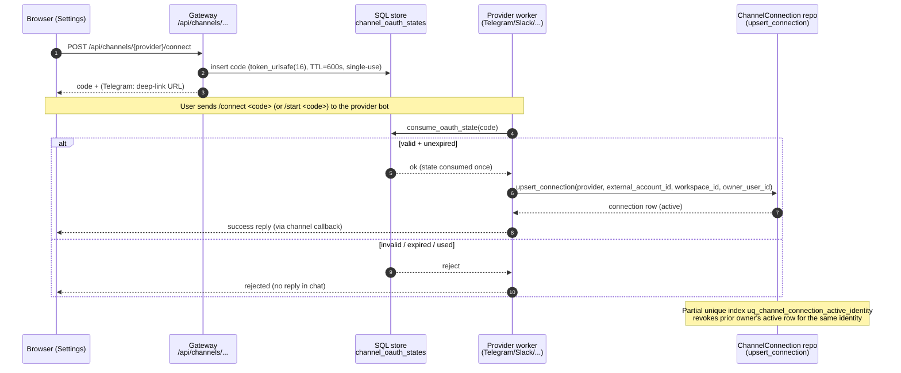
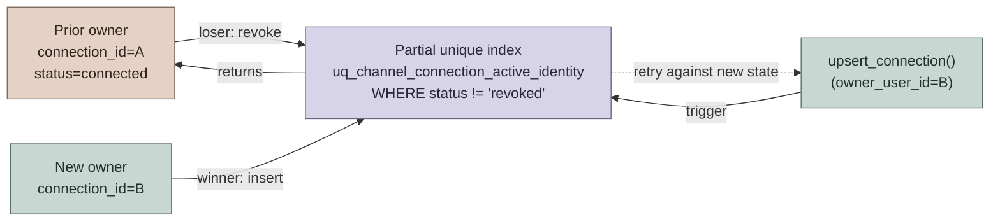
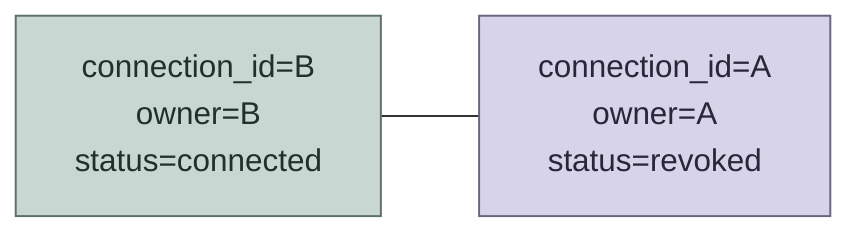
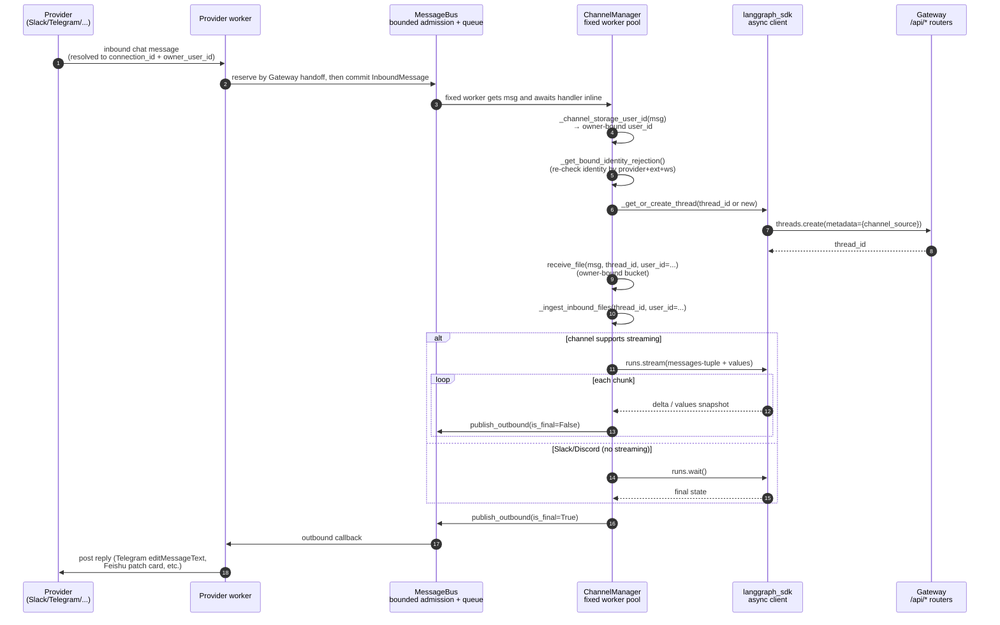
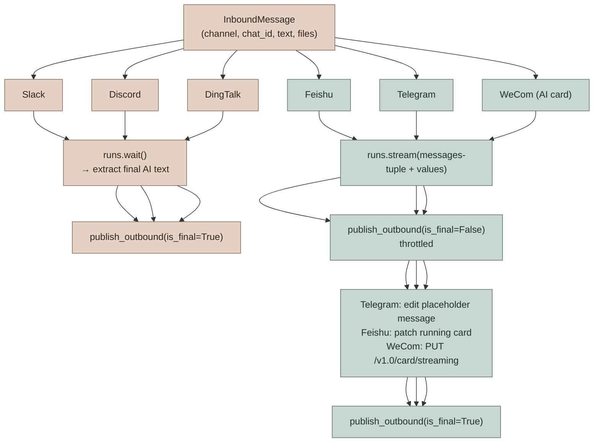
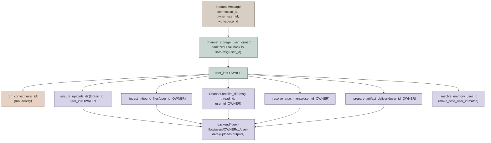

# IM Channel Connections

DeerFlow supports user-owned IM channel bindings for Telegram, Slack, Discord, Feishu/Lark, DingTalk, WeChat, WeCom, and Buzz. The feature reuses the existing `channels.*` runtime configuration, so it works in local and private deployments with the same outbound transports already supported by DeerFlow.

No public IP, OAuth callback URL, or provider webhook is required in this implementation.

This document covers both **architecture** (how the bind / dispatch / file pipeline fits together) and **configuration / operations** (the existing `config.yaml` knobs and security notes). For the high-level orientation, see [AGENTS.md](../AGENTS.md) → "IM Channels System".

---

## Architecture Overview

A user-owned IM channel connection is a **per-DeerFlow-user bind layer** layered on top of the existing provider bot credentials in `channels.*`. The connection layer adds three things the bot credentials alone cannot give you:

1. **Owner identity** — each `(provider, external account, workspace)` maps to exactly one DeerFlow account (`owner_user_id`). Every run created from that connection runs in the owner's bucket (memory, uploads, outputs, custom agent).
2. **One-time bind codes** — the browser Connect flow mints a short-lived `secrets.token_urlsafe(16)` code (600 s TTL, single-use) and surfaces it only in the initiating user's browser. The platform worker consumes `/connect <code>` (Telegram uses `/start <code>` over a deep link) before applying any `allowed_users` filter, so a not-yet-allowlisted user can complete their first bind.
3. **Strict ownership transfer** — the latest successful bind wins; `upsert_connection` revokes other owners' active rows for the same external identity. The DB-enforced partial unique index `uq_channel_connection_active_identity` (`WHERE status != 'revoked'`) makes the invariant race-free across concurrent writers.

Connect codes are deliberately **bind-time defenses**, not chat-time defenses. After binding, ordinary `allowed_users` continue to gate regular messages exactly as before.

## Connect-code Flow

The browser initiates; the provider worker consumes the code; the manager never sees the code itself.



## Single-active-owner Transfer

The partial unique index is the source of truth — application code never has to "revoke the previous owner" explicitly because the upsert that re-uses an identity fails on conflict and the loser retries against the now-visible revoked state.



After the dust settles:



The same invariant protects the `find_connection_by_external_identity` lookup used by `ChannelManager._get_bound_identity_rejection` — a non-revoked row can resolve to exactly one owner at any time.

## Provider Message Flow Once Bound

After a connection is bound, every inbound message walks the same path through `ChannelManager`. Slack/Discord (no streaming) and Feishu/Telegram (streaming) diverge only at the run boundary.



### Inbound capacity and overload behavior

Three top-level `channels` settings control the MessageBus/manager lifecycle: `inbound_queue_maxsize` (default `1000`) covers queued messages plus provider-side reservations that may still be doing final identity/ack preparation, `max_concurrency` (default `5`) is the exact number of long-lived `ChannelManager` workers, and `shutdown_grace_period_seconds` (default `3`) bounds graceful draining before active handlers are cancelled. Active handlers run inline in those workers, so a burst cannot create a task per message. The maximum manager-owned live intake is therefore the pending capacity plus the fixed worker count.

Admission never waits for queue space, because waiting producer coroutines would simply move the unbounded backlog outside the queue. At capacity:

- Slack, Discord, Feishu/Lark, DingTalk, Telegram, WeChat, and WeCom drop the new message before DeerFlow sends its working acknowledgment. `MessageBus` emits a rate-limited warning with a cumulative rejection count.
- Buzz leaves the per-channel replay watermark unchanged and reconnects, allowing relay history to replay the event.
- GitHub webhook fan-out returns `503`. GitHub records the delivery as failed; an operator or recovery job can retry it through the Recent Deliveries UI or REST redelivery API (GitHub does not retry failed deliveries automatically).

Shutdown first closes admission and cancels follow-up watchers, but keeps provider transports alive while workers drain accepted messages for up to `shutdown_grace_period_seconds`. Once that grace expires, it cancels active handlers, discards queue entries that never began, and awaits every manager-owned worker and watcher. Provider coroutines submitted from SDK threads are likewise retained, cancelled, and awaited before their channel tears down SDK resources. A successful stop therefore leaves no owned handler able to use a closed transport. The Gateway's outer shutdown timeout remains the process-level bound; if it cancels cleanup, the service retains its transports and singleton instead of reporting a successful stop or hiding unfinished ownership.

## Sync vs Streaming Channels

The two paths split on `ChannelRunPolicy.supports_streaming` (per-channel registration in `CHANNEL_CAPABILITIES`):



For the special GitHub case (`fire_and_forget=True` channel policy), the manager calls `runs.create()` and returns once the run is `pending` — no outbound reply, because GitHub agents post via the `gh` CLI from inside their sandbox. See [GITHUB_AGENTS.md](GITHUB_AGENTS.md) for the full GitHub flow.

## Owner-scoped File Storage

`ChannelManager` resolves the storage owner **once** at the top of `_handle_chat` via `_channel_storage_user_id(msg)` and threads that value through the entire file pipeline. The same identity is used as the run `user_id` in `run_context` and as the bucket for memory, uploads, and outputs — so the bucket the agent reads/writes is always the bucket where channel files were staged.



The cached value is reused across the blocking (`runs.wait`) and streaming (`_handle_streaming_chat`) paths — even if a future `Channel.receive_file` returns a rewritten `InboundMessage`, uploads and artifact delivery still target the same bucket.

## IM File Attachment Pipeline

Inbound files (images, documents) first pass through `Channel.receive_file` for
provider-specific materialization. Attachments that continue through the shared
metadata path are staged by `_ingest_inbound_files`; their metadata is placed in
`HumanMessage.additional_kwargs.files`, and `UploadsMiddleware` injects a
`<current_uploads>` block for the current message. Some providers instead consume
their descriptors while downloading and rewrite placeholders or message text with
the resulting virtual path (or a failure notice). Historical uploads are not
automatically injected on later turns; the agent discovers them with
`list_uploaded_files`.

Feishu/Lark inbound resource streams are read with a 20,000,000-byte cap before
they are persisted or synced into a non-local sandbox. Oversized resources and
per-file path failures are surfaced as a failure placeholder in the message text
without aborting later attachments in the same inbound message.

```mermaid
sequenceDiagram
    autonumber
    participant IM as Provider message<br/>(file attachment)
    participant Worker as Provider worker
    participant Mgr as ChannelManager
    participant Ch as Channel impl<br/>.receive_file
    participant FS as Uploads directory<br/>users/OWNER/.../uploads/
    participant MW as UploadsMiddleware
    participant Agent as Agent run

    IM->>Worker: message with file URL/bytes
    Worker->>Mgr: InboundMessage(files=[...], connection_id, owner_user_id)
    Mgr->>Mgr: storage_user_id = _channel_storage_user_id(msg)
    Mgr->>Ch: receive_file(msg, thread_id, user_id=storage_user_id)
    Note over Ch: provider-specific download/decrypt/read;<br/>may persist or hand bytes to manager
    Ch-->>Mgr: materialized message<br/>(provider may rewrite placeholders/text)
    alt attachment continues through shared metadata path
        Mgr->>FS: _ingest_inbound_files(<br/>thread_id, msg, user_id=storage_user_id)
        FS-->>Mgr: uploaded file metadata
        Mgr->>MW: HumanMessage with<br/>additional_kwargs.files
        MW->>Agent: prepend <current_uploads><br/>(paths under /mnt/user-data/uploads/)
    else provider supplies virtual path in message text
        Ch->>FS: persist and/or sync attachment
        Mgr->>Agent: HumanMessage with rewritten path<br/>or failure notice
    end
    Agent->>FS: read_file / view_image (sandbox)
```

## Cross-references

- [AGENTS.md](../AGENTS.md) → "IM Channels System" — the index view in `backend/AGENTS.md` (configuration knobs, message flow, component list)
- [GITHUB_AGENTS.md](GITHUB_AGENTS.md) — webhook-driven GitHub channel, agent bindings, fan-out, token lifecycle
- `app/channels/manager.py` — dispatcher, `_channel_storage_user_id`, `_handle_chat`, `_handle_streaming_chat`
- `deerflow.persistence.channel_connections` — SQL tables (`channel_connections`, `channel_oauth_states`, `channel_conversations`, `channel_credentials`) and `upsert_connection` / `consume_oauth_state` / `find_connection_by_external_identity`

---

# Configuration

Configure the actual IM bots under the existing `channels` block:

```yaml
channels:
  inbound_queue_maxsize: 1000
  max_concurrency: 5
  shutdown_grace_period_seconds: 3

  telegram:
    enabled: true
    bot_token: $TELEGRAM_BOT_TOKEN

  slack:
    enabled: true
    bot_token: $SLACK_BOT_TOKEN
    app_token: $SLACK_APP_TOKEN

  discord:
    enabled: true
    bot_token: $DISCORD_BOT_TOKEN

  feishu:
    enabled: true
    app_id: $FEISHU_APP_ID
    app_secret: $FEISHU_APP_SECRET

  dingtalk:
    enabled: true
    client_id: $DINGTALK_CLIENT_ID
    client_secret: $DINGTALK_CLIENT_SECRET

  wechat:
    enabled: true
    bot_token: $WECHAT_BOT_TOKEN

  wecom:
    enabled: true
    bot_id: $WECOM_BOT_ID
    bot_secret: $WECOM_BOT_SECRET

  buzz:
    enabled: true
    relay_url: wss://buzz.example.com
    private_key: $BUZZ_PRIVATE_KEY   # hex or nsec1…
```

Then enable user bindings in `channel_connections`:

```yaml
channel_connections:
  enabled: true
  # Auth-enabled deployments require ordinary IM messages to come from a
  # connected DeerFlow user by default. Set this to false only for legacy
  # operator-owned/open-bot deployments that intentionally route unbound
  # platform users to platform-ID user buckets.
  require_bound_identity: true

  telegram:
    enabled: true
    bot_username: $TELEGRAM_BOT_USERNAME

  slack:
    enabled: true

  discord:
    enabled: true

  feishu:
    enabled: true

  dingtalk:
    enabled: true

  wechat:
    enabled: true

  wecom:
    enabled: true

  buzz:
    enabled: true
```

`channel_connections` does not duplicate provider secrets. It only controls the browser-facing connect UI and stores per-user binding records. Telegram needs `bot_username` only so the frontend can open a deep link.

When `channel_connections.enabled` and `require_bound_identity` are true, auth-enabled deployments reject ordinary unbound IM messages before creating a DeerFlow thread or run. Users must connect the channel from DeerFlow Settings first. Auth-disabled local mode still routes channel messages to the auth-disabled default user, and legacy open-bot behavior can be restored explicitly with `require_bound_identity: false`.

Upgrade note: existing auth-enabled deployments that already have `channel_connections.enabled: true` will start rejecting ordinary unbound IM messages after this field is introduced because `require_bound_identity` defaults to true. Legacy operator-owned/open-bot deployments that intentionally allow unbound platform users to create DeerFlow runs should set `require_bound_identity: false` before upgrading and restart the service.

## Connect Flow

Telegram:

- The frontend creates a short one-time code.
- The Connect button opens `https://t.me/<bot_username>?start=<code>`.
- The existing Telegram long-polling worker receives `/start <code>` and binds that Telegram chat/user to the current DeerFlow user.

Slack:

- The frontend creates a short one-time code.
- The UI shows `Send /connect <code> to the DeerFlow Slack bot.`
- The existing Slack Socket Mode worker receives the message and binds the Slack user/team to the current DeerFlow user.

Discord:

- The frontend creates a short one-time code.
- The UI shows `Send /connect <code> to the DeerFlow Discord bot.`
- The existing Discord Gateway worker receives the message and binds the Discord user/guild to the current DeerFlow user.

Feishu/Lark, DingTalk, WeChat, and WeCom:

- The frontend creates a short one-time code.
- The UI shows `Send /connect <code> to the DeerFlow <Provider> bot.`
- The already-running long-connection or polling worker receives the message and binds the platform user/workspace identity to the current DeerFlow user.

Buzz:

- Unlike the bot/app credentials above, Buzz has no separate developer console: DeerFlow joins the relay as an ordinary member identity. Generate a Nostr keypair for that identity — everything below refers to its **hex public key**.
- **Onboarding takes two separate steps, and both are required.** Relay membership and channel membership are different things, and doing only the first produces a connector that connects and authenticates cleanly while receiving nothing:

  1. **Register the pubkey as a relay member** — `buzz-admin add-member --pubkey <hex>`. This is what lets the identity authenticate (NIP-42) and publish at all.
  2. **Add it to each channel it should participate in** — `buzz channels add-member --channel <uuid> --pubkey <hex> --role bot`. Chat events are only delivered to a channel's members, and the relay additionally **rejects** any message that `p`-mentions a non-member with `mentioned pubkeys are not channel members` — so without this step the connector can neither hear a mention nor answer one.

  See the [Buzz project](https://github.com/block/buzz) for the admin tooling.
- **Channels are auto-discovered — you do not list them in `config.yaml`.** On every connection the connector asks the relay which channels this identity belongs to and subscribes to each one individually. Adding it to a new channel later takes effect **live**, without a restart or reconnect: the relay sends a membership notification and the connector starts listening immediately (and stops listening when it is removed). If you see `channel discovery returned no channels` in the logs, step 2 above has not been done.
- Configure `relay_url` and `private_key` (hex or `nsec1…`) under `channels.buzz`, then enable `channel_connections.buzz`.
- The frontend creates a short one-time code.
- The UI shows `Send /connect <code> to the DeerFlow Buzz bot.`
- The already-running Buzz relay-loop worker receives the message — sent as a DM or an @mention in a channel both parties belong to — and binds the sender's Nostr pubkey to the current DeerFlow user.
- Requires the `buzz` dependency extra (`uv sync --extra buzz`) for the `coincurve` library. `scripts/detect_uv_extras.py` (and Docker/production builds via `backend/Dockerfile`) auto-detect and preserve this extra when `channels.buzz.enabled: true` in `config.yaml`, the same way the `browser` extra is auto-detected for `browser_navigate`.

### Buzz subscription model

Buzz's relay only delivers chat events to **channel-scoped** subscriptions, which is why the connector's subscriptions look the way they do. A global `REQ {"kinds":[9]}` is accepted and answered with `EOSE`, but no chat event is ever fanned out to it, and a single subscription cannot cover several channels either (a multi-value `#h` matches nothing). So, on **every** connection, after NIP-42 auth completes:

| Subscription | Filter | Purpose |
|---|---|---|
| `buzz-discovery` | `{"kinds":[39000]}` | Historical query listing exactly the channels this identity is a member of (one stored event each, then `EOSE`). Supplies each channel's name and type, which is also what the DM mention-exemption reads. Do **not** narrow it with `#p` — that matches nothing. |
| `buzz-membership` | `{"kinds":[44100,44101], "#p":["<our pubkey>"], "since": …}` | **Live** membership notifications. `44100` (added) subscribes to the new channel immediately; `44101` (removed) closes that channel's subscription. This is what makes a newly added channel work without a restart. |
| `buzz-chat-<uuid>` | `{"kinds":[9], "#h":["<uuid>"], "since": …}` | One per discovered channel — the only shape that actually receives messages. |

Consequences worth knowing operationally:

- **Replay is tracked per channel.** Each channel carries its own `since` watermark, advanced only by events DeerFlow actually processed. A single shared watermark would let a busy channel drag the cursor past a quiet channel's unread messages and skip them after a reconnect; per-channel cursors can only ever cost duplicate delivery (which the manager's inbound dedupe absorbs), never a miss.
- **Membership is scoped to live events.** The relay *stores* 44100/44101 events, so without a `since` every connection replayed the whole membership history as if it had just happened — re-running channel discovery once per stored add (you would see several `channel discovery complete` lines for one connect, and channels logged as `<unnamed>`), re-subscribing channels you have since been removed from, and briefly unsubscribing channels you are still in. The subscription is therefore anchored at the moment the socket opened, minus 60s of slack so a membership change made *during* the connect/auth handshake — or a small relay clock skew — is still picked up.
- **The number of channel subscriptions is capped** (256). The channel list comes off the wire, so it is bounded like any other remote-fed state. At the cap, new channels are refused and named in a `per-channel subscription limit reached` warning rather than an existing, working subscription being evicted.
- **A subscription the relay closes is re-opened, up to 3 times per connection.** Every subscription on the socket fails *silently* when the relay drops it: a chat subscription deafens one channel, `buzz-membership` stops DeerFlow ever learning it was added to or removed from a channel, `buzz-discovery` kills the completeness sweep. So a `CLOSED` frame is recovered, not just noted, and the subscription that went quiet is always named at WARNING level. Recovery is skipped when the relay's stated reason says the subscription is not ours any more — a NIP-01/NIP-42 `auth-required:` / `restricted:` / `blocked:` / `invalid:` prefix, or buzz-relay's own revocation wording — because re-issuing the same REQ then just fights the relay. Any other reason (including a `CLOSED` with no reason at all) is treated as a hiccup and retried, with the 3-attempt budget as the backstop; after that it stays down until the next reconnect, which rebuilds everything from scratch.
- **Known bound: more than 2000 unread messages in one channel across a disconnect loses the oldest of them.** The relay caps historical delivery at 2000 events per subscription and serves them newest-first, even with a `since`. DeerFlow processes what it receives and the channel's watermark advances past the rest, so those older messages are never delivered and never retried. Every other gap in the design fails toward duplicate delivery (which is absorbed by inbound dedupe); this is the one remaining case that can skip, and it needs both a disconnect and a >2000-message backlog in a *single* channel to occur.

### Buzz trust model

On a team-run Buzz relay the relay operator is not necessarily the DeerFlow operator, so be precise about what the connector proves and what it takes on trust:

**Verified (cryptographically, on every inbound event):** DeerFlow recomputes each event's NIP-01 id from the delivered payload and verifies its BIP-340 Schnorr signature against the claimed `pubkey` before the event can influence anything. A relay therefore cannot rewrite a member's message, replay one author's signature onto another payload, or claim an allowlisted author it does not hold the key for. This applies to `/connect` binds as well as ordinary chat, so a relay cannot bind someone else's pubkey to an attacker's DeerFlow account. Events that fail verification are dropped with a warning.

**Trusted (not verified):** the *authorship* of kind-39000 channel metadata. Buzz publishes channel discovery events from the relay's own keypair, but nothing already configured identifies that key (`relay_url` is a network address, not a signing key), so DeerFlow only proves such an event was signed by *some* member. Because channel discovery and subscription are now driven by exactly these events, a forged kind-39000 has two effects, not one:

1. It can mark a channel `type: "dm"`, which relaxes the `require_mention` requirement for that channel.
2. It can make DeerFlow **open a chat subscription** for a channel of the forger's choosing, since the set of channels DeerFlow listens to is the set it holds metadata for.

Neither can make anything be *acted on*. The `allowed_users` allowlist and per-event signature verification are independent gates: an author who is not allowlisted is dropped regardless of channel type or how the subscription was opened. The blast radius of (2) is a relay reading its own traffic back to a subscriber that ignores it, bounded by the 256-subscription cap (which refuses new subscriptions rather than evicting working ones, so an induced subscription cannot displace a real channel). The same applies to a forged kind-44100 membership notification, except that its `p` tag is re-checked locally, so it must at least name this identity. If you need the mention requirement to be unforgeable on a relay whose members you do not all trust, keep those channels out of `mention_free_channels` and treat DM detection as convenience rather than a boundary.

**Deny-by-default allowlist:** unlike other providers (where an empty `allowed_users` means "allow everyone"), `channels.buzz.allowed_users` is deliberately deny-by-default — an empty list means *nobody* can trigger a run, and DeerFlow logs a startup warning saying so. Add each member pubkey (hex or `npub1…`) that should be able to reach the agent. Individual drops are logged at DEBUG level.

**Bound identity:** once a pubkey completes `/connect`, its inbound messages resolve to that connection and run under the bound DeerFlow user (memory, files, and artifacts land in that user's buckets). Bindings are scoped to the relay host, so the same pubkey on a different relay is a different identity and must bind separately.

Codes use 128 bits of randomness, expire after 10 minutes, and are single-use.

For providers with an `allowed_users` allowlist (Telegram, Slack, DingTalk, WeChat, …), a valid `/connect <code>` (or Telegram `/start <code>`) is consumed **before** the allowlist is checked. This is intentional: a user who is not yet on the allowlist — and whose platform identity the bot has therefore never seen — can still complete their first browser-initiated bind. After binding, `allowed_users` continues to gate ordinary (non-bind) messages as before.

## Runtime Model

Connection records live in SQL tables under `deerflow.persistence.channel_connections`:

- `channel_connections`: owner user, provider identity, workspace/guild/team, status, metadata.
- `channel_oauth_states`: one-time connect codes and Telegram deep-link state.
- `channel_conversations`: connection-scoped IM conversation to DeerFlow thread mapping.
- `channel_credentials`: reserved for future provider-token flows, not used by the local/private binding flow.

Incoming messages that resolve to a connection carry `connection_id`, `owner_user_id`, and `workspace_id`. `ChannelManager` uses `owner_user_id` as the DeerFlow run user id and preserves the raw platform user id as `channel_user_id`.

Runtime provider credentials are deployment-level bot secrets, not user-owned
connection credentials. They can come from `channels.*` in `config.yaml` or
from the browser runtime setup flow, which persists them through
`ChannelRuntimeConfigStore` so local/private deployments can configure bots
without editing YAML. The runtime store is a local plaintext JSON fallback with
owner-only file permissions (`0600`); use it only where the DeerFlow data
directory is already trusted as secret storage. WeChat QR login auth state
follows the same local-runtime model and may persist a QR-derived bot token in
the channel state directory.

## Security Notes

- Browser APIs remain authenticated and CSRF-protected.
- Connect codes are 128-bit random, short-lived, and single-use.
- Runtime provider bot tokens are shared deployment secrets. Runtime setup
  responses mask password fields, and mutating runtime/channel-worker APIs
  require an admin user.
- Stored per-connection credentials use the `channel_credentials` encryption
  path. If stored credential material cannot be decrypted, DeerFlow treats it
  as unavailable instead of using corrupt secrets.
- The local plaintext runtime credential fallback is documented above; prefer
  deployment-managed environment/config secrets for non-local deployments until
  a dedicated secret backend is configured.
- `allowed_users` is **not** a bind-time defense. Because connect codes are processed before the allowlist (see Connect Flow), anyone who possesses a valid code can consume it — not only allowlisted users. Bind security therefore rests entirely on the code's confidentiality: it is 128-bit random, expires after 10 minutes, is single-use, and is shown only in the initiating user's browser (never echoed back to chat). Treat connect codes like one-time passwords and do not forward them.
- An external identity — `(provider, external account, workspace/team/guild)` — has at most one active owner. The most recent successful bind wins: connecting an identity that another DeerFlow user already holds transfers ownership and revokes the previous owner's binding (and its stored credentials). This is enforced at the database layer, so two users racing to bind the same identity cannot both end up connected.
- Provider bot tokens remain in `channels.*` and are never returned to the browser.
- Stored per-connection credentials are encrypted. If stored credential material cannot be decrypted, DeerFlow treats it as unavailable instead of using corrupt secrets.
- This implementation does not add public provider callback or webhook routes.
