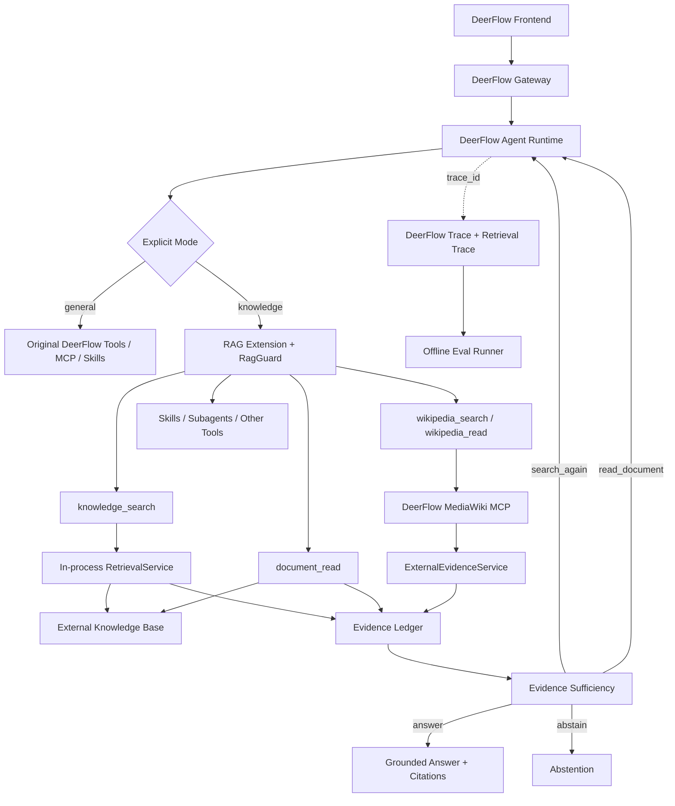

# Agentic RAG 系统范围与架构基线 v1.1

> 状态：Confirmed Architecture Baseline  
> 更新时间：2026-08-29  
> 实现基础：DeerFlow  
> 本文是 `00–09` 文档的最高优先级决策源；下游文档若与本文冲突，以本文为准。

---

## 1. 系统定位

本项目不是从 DeerFlow 中抽取核心代码另起炉灶，而是在现有 DeerFlow 上增加一个 RAG Extension，形成：

> **RAG-first General Agent：以严格知识问答为主，同时保留 DeerFlow 的通用 Agent、MCP、Skill、Subagent、Sandbox、Memory 和多模态入口。**

系统提供两个显式模式：

```text
knowledge
→ 严格证据约束的 Agentic RAG

general
→ 保留 DeerFlow 原有通用 Agent 行为
```

V1 不提供 `auto` 模式，不让模型猜测用户是否要求严格知识回答。

---

## 2. 核心目标

V1 必须证明以下闭环真实有效：

1. 每次内部知识搜索都执行受控 Query Expansion；
2. BM25 与 Vector 能召回互补证据；
3. Weighted RRF、FastPass、Reranker、LLM Grading 能提升或保留正确证据；
4. Agent 能判断证据是否充分，并在必要时补搜或精读；
5. 全文不会无控制地塞入 LLM Context；
6. 最终事实段落有可追溯 Evidence 和 Citation；
7. 没有充分证据时能够拒答；
8. DeerFlow 的 MCP、Skill、Subagent 等 Agent 能力仍可参与任务；
9. 效果、成本和延迟能够离线复现与比较。

---

## 3. V1 范围

### 3.1 复用 DeerFlow

保留并复用：

- Frontend 与 Gateway；
- Conversation / Thread / Run；
- LangGraph Agent Runtime；
- Checkpoint 与运行恢复基础；
- Tool、MCP、Skill、Subagent；
- Sandbox 和文件 Artifact；
- Long-term Memory 基础能力；
- 图片输入和视觉模型切换；
- 现有 Trace ID、LangSmith / Langfuse 接入和运行统计。

### 3.2 新增 RAG Extension

新增：

- `knowledge` 模式；
- `RetrievalService`；
- `knowledge_search`；
- `document_read`；
- Query Expansion；
- BM25 / Vector 调用与 Weighted RRF；
- FastPass → Reranker → LLM Grading；
- Evidence Ledger；
- Evidence Sufficiency；
- `RagGuardMiddleware`；
- 段落级 Citation 和 Abstention；
- 结构化 Retrieval Trace；
- 离线 Eval Runner；
- 一个只读 MediaWiki MCP 外部证据源扩展证明。

### 3.3 外部依赖

外部 Knowledge Base 负责：

- 文档和 Chunk 存储；
- Metadata；
- BM25 原始检索；
- Vector 原始检索；
- 文档正文读取；
- 索引生命周期。

RAG Extension 不重新建设知识入库平台、搜索引擎或向量数据库。

---

## 4. V1 非目标与延期项

以下不作为 V1 高优先级交付：

- 自动 `knowledge/general` 模式判断；
- Knowledge Graph Retrieval；
- 多模态知识库索引；
- 复杂权限治理和多租户隔离；
- 自动跨会话事实记忆抽取；
- 自研 MCP Client、通用 MCP Router 或 Executor；
- 多 MCP 并行和跨 MCP 排序；
- 独立 Retrieval 微服务；
- 新建 OpenTelemetry 平台；
- 自研跨实例 SSE Remote Proxy / Snapshot Recovery；
- 统一 Web Search 主链路；
- 配置中心和管理页面。

上述能力可以保留扩展点，但不得提前侵入 V1 核心链路。

---

## 5. 总体架构



---

## 6. 架构边界

### 6.1 DeerFlow Harness

负责 Agent Runtime、Graph、Tool 执行、MCP、Skill、Subagent、Sandbox、Memory、Checkpoint 和 Trace。

### 6.2 RAG Extension

通过 DeerFlow Extension 机制增量接入，不修改或复制 DeerFlow 核心实现。它负责 RAG Tool、检索质量、Evidence、Grounding 和相关 Trace。

### 6.3 Retrieval System

负责“一次内部搜索怎样返回高质量 Evidence”，不决定任务是否完成。

### 6.4 Agent

负责选择 Tool、判断证据是否充分、决定补搜/精读/回答/拒答，不直接控制 BM25、Vector、Reranker 等内部步骤。

### 6.5 Knowledge Base

负责原始数据与索引，不负责 Agent 决策、最终 Evidence 充分性或回答生成。

---

## 7. `knowledge` 模式主循环

```text
User Query
  ↓
Resolve Conversation Query
  ↓
knowledge_search
  ↓
Retrieval Pipeline
  ↓
Evidence Ledger
  ↓
Evidence Sufficiency
  ├─ answer        → Grounded Answer
  ├─ search_again  → 新 Query / 新来源
  ├─ read_document → 精读关键文档
  └─ abstain       → 拒答
```

Evidence Sufficiency 固定为：

```text
sufficient: bool
reason: string
next_action: answer | search_again | read_document | abstain
```

不建立 `PARTIAL / INSUFFICIENT / CONFLICTED` 等第二套状态机。冲突和缺口写入 `reason` 及结构化 Trace。

Agent Loop 受以下约束：

- `max_iterations` 可配置；
- 相同 Query / 相同 Evidence 不重复搜索；
- 连续没有新增 Evidence 时提前停止；
- 达到预算仍不足时拒答；
- External MCP Search 仍属于 `search_again`，不增加新 Action。

---

## 8. 内部 Retrieval Pipeline

每次 `knowledge_search` 都执行：

```text
Original Query
  ↓
Query Expansion: Original + 1~3 Semantic Variants
  ↓
BM25 + Vector per Query
  ↓
Weighted RRF
  ↓
FastPass
  ↓
Reranker
  ↓
LLM Grading
  ↓
Evidence Normalize
```

约束：

- 原问题始终保留且权重大于 Variant；
- Variant 保留实体、日期、数字和 ID，不引入新事实；
- Query Expansion 失败时退化为 Original Query；
- Reranker 和 Grader 都针对 Original Query 评分；
- BM25 与 Vector 初始权重相等，通过评估调整；
- 融合记录命中的 Query、Retriever 和 RRF Contribution；
- FastPass 依据多 Retriever 一致、多 Query 一致、强精确匹配与 Metadata 约束；
- 不使用未经校准的 `score >= 0.7` 规则。

---

## 9. Tool 基线

### 9.1 `knowledge_search`

一次完整内部检索，返回规范化 Evidence 和 Trace Summary。Agent 不直接调用 BM25、Vector、Fusion、Reranker 或 Grader。

### 9.2 `document_read`

按 `document_id` 读取原文。完整正文由代码直接获取并保存为 Artifact；LLM 只读取与当前 Focus 相关的受控章节或片段。全文任务采用分段读取或 Subagent，不把全文一次性加入 Context。

### 9.3 `wikipedia_search` / `wikipedia_read`

基于只读 ProfessionalWiki MediaWiki MCP。默认中文 Wikipedia，无可用中文候选时只回退一次英文；不进入内部 BM25/Vector Rerank。详细设计见 `09-mcp-external-evidence-design.md`。

### 9.4 Skill

保留 DeerFlow Skill。计划在 V1 实现一个 `knowledge-research` 示例 Skill，用于编排证据 Tool；当前只保留设计，不创建 Skill 文件。Skill 不是证据来源，不能绕过 RagGuard。

---

## 10. Evidence 与 Grounding

Evidence 是统一中间对象。至少包含：

```text
evidence_id
content
source_type
source_name
source_uri
title
document_id / external_id
document_version / source_revision
index_version
content_hash
retrieved_at
publish_time / update_time
authority
provenance
```

核心规则：

- 内部搜索、全文读取和证据型 MCP 最终都转换为 Evidence；
- 跨来源不比较原始 Retrieval Score；
- 相关性、Context Priority、Authority 分开处理；
- 来源冲突不静默覆盖；
- 企业正式知识默认高于通用公开来源；
- 历史 Evidence 只在同一会话、同一用户/范围/版本下复用；
- 历史回答文本本身不是 Evidence；
- 最终事实段落必须带有效 Evidence Citation；
- 第一次 Grounding 失败自动修复一次，第二次失败拒答。

---

## 11. RagGuardMiddleware

只设置一个 RAG Guard，承担两个阶段的兜底：

### Tool Result 阶段

- 校验知识 Tool Result Schema；
- 校验来源、版本、哈希和降级状态；
- 防止原始外部内容作为 Agent Instruction；
- 登记 Evidence Ledger；
- 无效 Evidence 不进入严格知识 Context。

### Final Answer 阶段

- 校验事实段落是否有 Citation；
- 校验 Citation 是否引用本次可用 Ledger；
- 校验引用 Evidence 与回答是否一致；
- 失败时自动修复一次，仍失败则拒答。

Retrieval 的 FastPass、Reranker、Grading 仍属于 `RetrievalService`，不复制到 Middleware。

---

## 12. Memory、多模态与 Subagent

### Memory

- Conversation History 用于当前会话解析；
- Long-term Memory 只保存偏好和稳定上下文；
- V1 关闭自动跨会话事实抽取；
- Long-term Memory 不能替代严格知识 Evidence。

### 多模态

- 保留 DeerFlow 图片/截图输入与视觉模型切换；
- V1 Knowledge Retrieval 仍是文本检索；
- 图片知识索引、OCR 检索和跨模态向量属于后续能力。

### Subagent

仅用于：

- 长文分段精读；
- 可独立并行的子问题；
- 来源冲突复核；
- 全文总结。

普通单轮搜索不创建 Subagent。

---

## 13. 可靠性基线

降级规则：

```text
BM25 failure        → Vector only
Vector failure      → BM25 only
Reranker failure    → Fusion result
Grader failure      → Reranker result
Both retrievers fail→ 不生成事实性回答
MCP failure         → 保留内部 Evidence，继续判断或拒答
```

其他规则：

- Retry 只处理瞬时故障；
- 非幂等 Tool 不自动重试；
- 每层遵守 AgentRun Deadline；
- Trace/评估失败不能阻塞在线回答；
- 多实例 SSE 恢复不是 V1 高优先级；优先复用 DeerFlow 现有运行与流式能力，不在 RAG Extension 另建 Remote Proxy。

---

## 14. 配置与可复现性

检索配置统一为不可变 `RetrievalProfile`：

```text
query expansion
retriever top_k
RRF weights
FastPass policy
Reranker
Grader
max search rounds
MCP budget
```

每次运行记录：

- `profile_version / config_hash`；
- Prompt 版本；
- 模型与 Reranker 版本；
- Document / Index 版本；
- Dataset 版本；
- DeerFlow Agent Assembly / Build 信息。

V1 使用配置文件，不建设配置中心。

---

## 15. Evaluation 基线

### V1 核心指标

- Evidence Recall@10 / Hit@10；
- Gold Evidence Retention Rate；
- Search Recovery Rate；
- Answer Accuracy；
- Groundedness；
- Abstention F1；
- P95 Latency；
- Token Cost。

诊断指标和 KG 专项指标不进入 V1 核心看板，详见 `07-evaluation-observability.md`。

### 数据集

- MIRACL-zh；
- HotpotQA；
- RAGBench；
- SQuAD 2.0（可选拒答集）；
- 后期约 30 题半自动项目领域验证集。

### 评分

- 确定性指标由程序计算；
- Answer / Groundedness / Sufficiency 使用固定版本 LLM Judge；
- Judge 只评分，不参与被测 Agent；
- 最终验收只抽查低分、临界和争议样本。

### 执行

独立离线 Eval Runner 通过真实 `knowledge` 接口执行，读取 Trace，不进入在线 Agent Graph。

---

## 16. 可观测性基线

复用 DeerFlow Trace ID、LangSmith / Langfuse 和运行统计。RAG Extension 增加：

- Query Expansion；
- BM25 / Vector；
- Fusion；
- FastPass；
- Reranker；
- Grading；
- Evidence Sufficiency；
- Search Round；
- MCP External Evidence。

Span 只保存摘要；完整 Candidate、Evidence 和分数写入关联 `trace_id` 的结构化 Retrieval Trace 或 Artifact。V1 不另建 OpenTelemetry 平台。

---

## 17. 分阶段边界

### V1：正确性闭环

- DeerFlow RAG Extension；
- 显式 `knowledge/general`；
- Internal Retrieval Pipeline；
- Evidence Ledger / RagGuard；
- Search / Read / Abstain；
- MediaWiki MCP 扩展证明；
- Evaluation 与 Trace；
- `knowledge-research` Skill 设计预留。

### P1：质量与来源扩展

- 更多只读 Evidence MCP；
- 多 MCP Discovery / 并行；
- KG Retrieval；
- Temporal / Conflict 策略增强；
- 正式实现 RAG Skill；
- 更多领域数据集。

### P2：生产增强

- 权限与多租户；
- 多模态知识索引；
- 配置管理界面；
- 根据实际缺口增强多实例恢复；
- 独立 Retrieval 部署（仅在容量或组织边界需要时）。

---

## 18. 文档职责

```text
00  范围、原则和最终决策
01  系统组件、依赖和部署
02  Agent 状态、循环和 Middleware
03  内部 Retrieval Pipeline
04  稳定接口和数据 Contract
05  数据归属、状态和持久化
06  Timeout、Retry、降级和运行可靠性
07  数据集、指标、Eval Runner 和 Trace
08  实施顺序、测试和验收
09  MediaWiki MCP 外部补充证据
```

---

## 19. 架构验收原则

架构与实现必须同时满足：

1. 不复制 DeerFlow Core；
2. `general` 模式不被 RAG 约束破坏；
3. `knowledge` 模式事实结论必须来自 Ledger；
4. Retrieval 与 Agent 决策解耦；
5. 全文不自动进入 LLM Context；
6. 每次内部搜索都执行受控 Query Expansion；
7. FastPass 不依赖未经校准的统一分数；
8. 失败路径最终能够安全拒答；
9. 评估结果可复现；
10. V1 不被权限、多实例、KG 和多 MCP 等延期能力拖垮。

