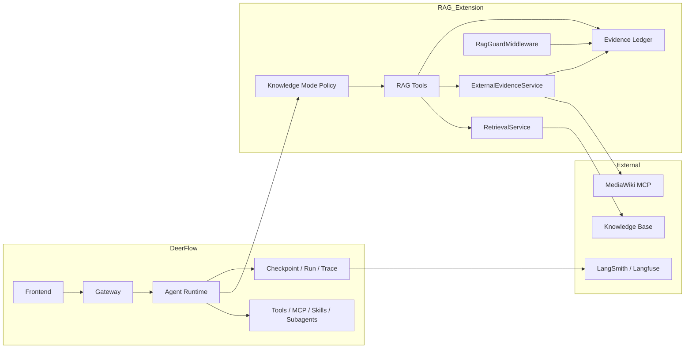
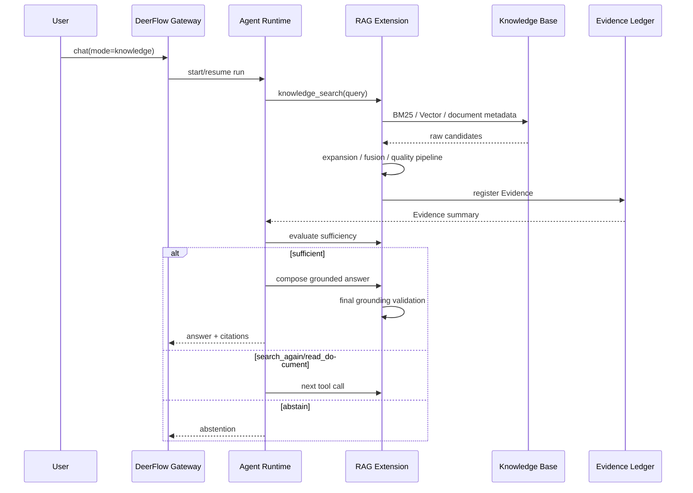
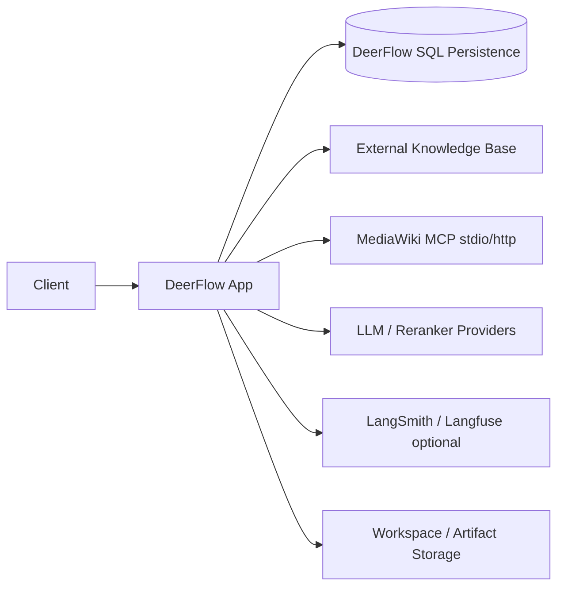

# Agentic RAG 系统总体设计 v1.1

> 上游：`00-architecture-baseline.md`  
> 目标：定义系统组件、依赖方向、运行组合和部署边界，不重复下游算法与接口细节。

---

## 1. 架构风格

V1 采用：

> **DeerFlow Harness + RAG Extension + In-process RetrievalService + External Knowledge Base。**

这是模块化单体，不是从 DeerFlow 复制代码形成新框架，也不是预先拆分的微服务系统。

核心原则：

- Extension 优先，避免 Core Fork；
- Agent 决策与 Retrieval Quality 解耦；
- 外部系统通过 Adapter 隔离；
- 事实证据统一进入 Evidence Ledger；
- `general` 与 `knowledge` 显式分流；
- 目标架构完整，但 V1 只实现必要闭环。

---

## 2. 逻辑组件



---

## 3. DeerFlow 与 RAG Extension 的边界

### DeerFlow 负责

- HTTP / SSE 接入；
- Thread、Run、Checkpoint；
- Agent Graph 和模型调用；
- Tool 执行；
- MCP Server 管理与 Tool Discovery；
- Skill 激活与 Tool Policy；
- Subagent 与 Sandbox；
- 文件和 Artifact 基础；
- Memory 基础；
- Trace ID、LangSmith / Langfuse、运行统计。

### RAG Extension 负责

- 请求模式约束；
- RAG Tool；
- RetrievalService；
- Evidence Ledger；
- Evidence Sufficiency；
- RagGuard；
- Citation / Abstention；
- RAG Trace；
- Evidence 型 MCP 适配。

RAG Extension 通过 DeerFlow Extension 的 Middleware、Service 和 Agent Assembly 扩展点装配，不在 DeerFlow Core 内复制实现。

---

## 4. 依赖方向

```text
DeerFlow Runtime
      ↓ calls
RAG Tool Facade
      ↓
RAG Application Services
      ↓
Domain Contracts
      ↑ implemented by
Knowledge / MCP / Model Adapters
```

禁止：

- Agent 直接调用 Retriever；
- Domain Model 依赖数据库或 MCP SDK；
- Knowledge Adapter 反向依赖 Agent；
- RagGuard 重复实现 Retrieval Pipeline；
- Eval Runner 被在线 Graph 调用；
- RAG Extension 改写 DeerFlow MCP Client。

---

## 5. 请求模式

API 必须显式携带：

```text
mode = knowledge | general
```

### `general`

走 DeerFlow 原生 Agent 行为。RAG Extension 不要求所有事实进入 Evidence Ledger。

### `knowledge`

启用 RAG Tool、Ledger、Sufficiency 和 RagGuard。MCP、Skill、Subagent 仍可使用，但事实结论必须由 Ledger 支撑。

V1 不实现 `auto`。

---

## 6. Tool Layer

### `knowledge_search`

调用一次完整 Retrieval Pipeline，输出内部 Evidence。

### `document_read`

读取关键文档。完整正文保存为 Artifact；受控片段进入 ToolMessage。

### `wikipedia_search` / `wikipedia_read`

通过 `ExternalEvidenceService` 包装只读 MediaWiki MCP。最终参数在 Adapter 实施阶段确定。

### DeerFlow 原生 Tool

在 `general` 模式保持原行为；在 `knowledge` 模式可以辅助计算和执行，但未经 Evidence Adapter 的结果不能作为严格事实证据。

### Skill

Skill 是可复用工作流，不是证据。计划的 `knowledge-research` Skill 只编排上述 Tool。

---

## 7. RAG Extension 内部组件

```text
RagExtension
├── ModePolicy
├── RagToolFacade
│   ├── knowledge_search
│   ├── document_read
│   ├── wikipedia_search
│   └── wikipedia_read
├── RetrievalService
├── DocumentReadService
├── ExternalEvidenceService
├── EvidenceLedger
├── EvidenceSufficiencyService
├── RagGuardMiddleware
├── CitationService
└── RetrievalTraceRecorder
```

这是逻辑分层，不要求 V1 每个名称独立成文件。先按职责实现，出现多个实现或明显复杂度后再拆模块。

---

## 8. 在线运行序列



---

## 9. Model Roles

逻辑角色必须可独立配置：

- Agent Model；
- Query Expansion Model；
- Reranker（Cross Encoder 或服务）；
- Grading Model；
- Evidence Sufficiency Model；
- Answer Model；
- Eval Judge Model；
- Vision Model。

多个角色可以在 V1 复用同一物理模型，但配置和 Trace 中必须保留角色名。

---

## 10. 数据与状态归属

| 数据 | 权威来源 |
|---|---|
| Thread / Run / Checkpoint | DeerFlow Persistence |
| Document / Chunk / Index | External Knowledge Base |
| Agent 当前 Evidence Ledger | Run State / Checkpoint |
| 完整文档和 MCP 长正文 | Artifact Store |
| Retrieval Trace | RAG Trace Store / Artifact |
| RetrievalProfile | Versioned Config |
| Eval Dataset / Result | Offline Eval Storage |
| Long-term Preference | DeerFlow Memory |

事实文档不复制成 RAG Extension 的第二份主数据。

---

## 11. 配置组合

```text
DeerFlow Config
├── models
├── gateway / persistence
├── tools / mcp / skills
└── tracing

RAG Extension Config
├── mode policy
├── knowledge adapter
├── retrieval profiles
├── evidence / grounding
├── external evidence sources
└── eval / trace export
```

`RetrievalProfile` 不可变并带 `config_hash`。Secrets 不进入普通 Profile，也不写入 Trace。

---

## 12. V1 部署



RetrievalService 与 RAG Extension 同进程部署。只有出现明确的容量、语言栈或团队边界时，才通过相同接口替换为远程实现。

---

## 13. 可靠性与安全边界

- 外部正文始终按 Data 处理；
- Knowledge Tool Result 先验证再进入 Agent；
- 严格模式最终回答经过 RagGuard；
- 失败按组件局部降级；
- 无证据时拒答，不以模型常识补齐；
- 权限治理延期，但 V1 MCP 必须只读；
- 不将完整文档、Secrets、Raw Prompt 或大候选集放入 Span。

---

## 14. 扩展点

### 新 Retriever

实现统一 Retriever Contract，并通过 RetrievalService 注册。

### KG

未来作为新 Retriever 加入候选生成，不改变 Agent Action 和 Evidence 模型。

### 新 Evidence MCP

复用 DeerFlow MCP，新增 Source Adapter 和 Evidence Policy，不新建 MCP Runtime。

### 新 Skill

编排已有 Tool，不复制业务服务。

### 远程 Retrieval

替换 `RetrievalService` 实现，保持 Tool 和 Domain Contract 不变。

---

## 15. 系统级验收

1. DeerFlow 原有 `general` 会话可正常运行；
2. `knowledge` 请求进入 RAG Extension；
3. Agent 看不到内部 Retriever Tool；
4. Evidence Ledger 能关联 Run、Tool Call 和版本；
5. 文档全文不自动进入模型；
6. 无 Citation 的事实回答被修复或拒答；
7. MediaWiki 失败不破坏内部知识路径；
8. 每次运行可追溯到 RetrievalProfile；
9. Eval Runner 可以通过线上同一接口重放；
10. 延期能力没有成为 V1 启动依赖。

