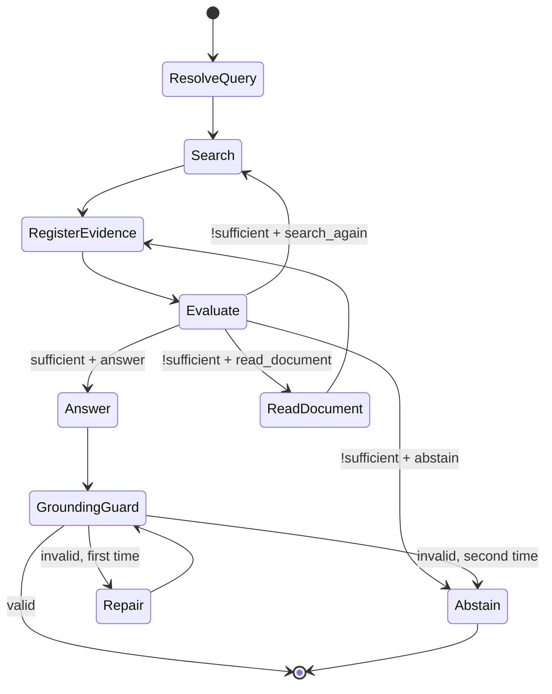

# Agent 核心流程与状态设计 v1.1

> 上游：`00-architecture-baseline.md`、`01-system-design.md`  
> 范围：只定义 Agent 的状态、决策、循环、Context 和 RagGuard；检索算法见 `03`。

---

## 1. Agent 职责

Agent 负责：

- 解析当前会话问题；
- 选择知识、文档、MCP、Skill 或 Subagent Tool；
- 判断 Evidence 是否充分；
- 决定回答、补搜、精读或拒答；
- 在预算内停止。

Agent 不负责：

- 决定 BM25/Vector TopK；
- 执行 Fusion、FastPass、Reranker、Grading；
- 解析知识库私有结构；
- 把普通 Tool Result 直接认定为 Evidence；
- 绕过 RagGuard 输出严格知识回答。

---

## 2. 模式入口

```text
mode=general
→ DeerFlow 原生 Agent

mode=knowledge
→ DeerFlow Agent + RAG Tool + Evidence Ledger + RagGuard
```

V1 不存在 `auto`。

---

## 3. Run State

RAG Extension 只增加必要状态：

```text
original_query
resolved_query
mode
iteration
search_history
document_read_history
mcp_call_history
evidence_ledger
last_evidence_evaluation
retrieval_profile_version
trace_id
```

状态必须可序列化并适配 DeerFlow Checkpoint。完整正文、Raw Candidate 和大 Trace 不放入 Run State，只保存引用。

---

## 4. Evidence Sufficiency

唯一决策模型：

```json
{
  "sufficient": false,
  "reason": "缺少目标项目最新正式版本和发布日期",
  "next_action": "search_again"
}
```

`next_action` 只能为：

```text
answer
search_again
read_document
abstain
```

不建立 `PARTIAL / INSUFFICIENT / CONFLICTED` 等并行状态。证据缺口、冲突、时效性和失败原因写入 `reason` 与 Trace。

---

## 5. 主循环



External MCP Search 是 `Search` 的一种 Tool 选择，不增加状态。

---

## 6. Query 的两个层次

### Agent Resolved Query

用于消解多轮指代和表达当前任务，例如将“它最新版本呢”解析为完整问题。

### Retrieval Query Expansion

由 RetrievalService 在每次内部搜索中执行，生成 Original + 1–3 Semantic Variants。

Agent 不预生成同义词或关键词列表，避免与 Retrieval Expansion 重复。

---

## 7. Search 决策

首次 `knowledge` 请求默认调用 `knowledge_search`；用户显式指定已登记外部来源时，可直接调用对应 MCP 证据包装工具。

后续 `search_again` 可以选择：

- 使用更具体的新 Query 再搜内部知识；
- 针对证据缺口读取关键文档；
- 调用已登记外部 Evidence MCP；
- 对独立子问题使用 Subagent。

选择依据：

- Sufficiency `reason`；
- 已有 Evidence；
- Search / Read / MCP History；
- 来源能力；
- 剩余预算。

---

## 8. No-progress 与预算

每次 Tool 结束后计算是否新增有效 Evidence。

提前停止条件：

- 相同 Tool + 相同或高度相似 Query 已执行；
- 新结果 Evidence ID / Content Hash 全部已存在；
- 连续搜索没有新增 Evidence；
- 所需来源不可用且没有替代来源；
- 达到 `max_iterations`、Tool 或 Token Budget。

停止时如果仍不足，必须 `abstain`。

---

## 9. Evidence Ledger

Ledger 是 Run-scoped 事实来源索引，记录：

```text
evidence_id
source identity
content reference / bounded excerpt
version / hash / retrieved_at
tool_call_id
retrieval_run_id
authority
validation status
```

规则：

- 只有通过 Schema 与来源校验的 Evidence 才能登记；
- 同一会话历史 Evidence 可在同一用户/范围/版本下复用；
- 版本变化后必须重新读取；
- Assistant 历史回答不是 Evidence；
- 普通 MCP、计算工具和 Memory Result 不自动登记。

---

## 10. Context 组装

LLM Context 由以下内容组成：

- System / Mode Policy；
- 当前问题和必要会话历史；
- Tool Schema；
- 当前相关 Evidence 片段；
- Evidence Ledger 摘要；
- 必要的执行状态提示。

不得默认加入：

- 完整文档；
- MCP 完整长正文；
- 所有 Raw Candidate；
- 全量 Retrieval Trace；
- Long-term Memory 中未经证据化的事实；
- Secrets 和内部异常堆栈。

---

## 11. Document Read

```text
document_read(document_id, focus)
  ↓
代码读取完整正文
  ↓
完整正文保存 Artifact
  ↓
结构化分段 / 相关片段选择
  ↓
受控片段进入 ToolMessage
```

全文总结或长篇精读采用分章节迭代或 Subagent。Agent 只看到当前所需片段与 Artifact 引用。

---

## 12. RagGuardMiddleware

### Tool Result Guard

- 识别 RAG Tool；
- 校验 Result Envelope；
- 校验 Evidence 字段和版本；
- 注册 Ledger；
- 将完整正文替换为受控片段 + Artifact Ref；
- 标记降级和无结果，不将异常伪装成无答案。

### Final Answer Guard

- 将回答拆为事实段落；
- 检查每个事实段落的 Evidence Citation；
- 检查 Citation 是否存在于 Ledger；
- 检查 Evidence 是否支持对应段落；
- 首次失败生成修复指令并重新回答一次；
- 第二次失败返回 Abstention。

Guard 不执行 Rerank 或 Grading。

---

## 13. Citation

V1 使用段落级 Citation：

```text
事实段落内容。[E1][E3]
```

Citation 绑定 `evidence_id`，展示层再解析为标题、来源、URL、版本和时间。

不引入复杂 Claim Entity。一个段落包含多个独立事实时，应拆段或引用多个 Evidence。

---

## 14. Conflict

发现冲突时：

1. 判断是否可通过精读或新来源解决；
2. 比较 Authority、时间、版本、完整性和直接性；
3. 不能可靠消解时明确描述冲突；
4. 冲突影响核心结论且无法解释时拒答。

冲突不是单独 Agent 状态。

---

## 15. Temporal

V1 通过：

- Query Time Filter；
- `publish_time / update_time`；
- 排序和 Evidence Evaluation；
- Agent 对“最新/截至某时”的判断。

不实现独立 Temporal Reranker。

---

## 16. Memory

- Conversation History：用于本会话指代与上下文；
- Long-term Memory：只保存偏好和稳定背景；
- V1 禁止自动把知识回答抽成跨会话事实；
- Memory 只能影响表达和 Tool 选择，不能替代 Evidence。

---

## 17. Skill

Skill 是提示和工作流包，可以引导 Agent 调用 RAG Tool。

计划的 `knowledge-research` Skill：

```text
解析任务
→ 内部 Search
→ 必要时 Read
→ 必要时外部 Evidence
→ Sufficiency
→ Citation / Abstention
```

当前只保留设计，实施阶段再创建 Skill 文件和具体 Prompt。

---

## 18. Subagent

使用条件：

- 长文分段；
- 多个互不依赖子问题；
- 冲突复核；
- 全文总结。

子 Agent 返回的是中间结果或 Evidence 引用，不直接绕过 Lead Agent 和 RagGuard 面向用户输出。

---

## 19. 多模态

图片问题复用 DeerFlow 视觉入口。图片本身可以进入视觉模型，但 V1 内部 Knowledge Retrieval 只检索文本 Evidence。

---

## 20. 典型路径

### 单次命中

```text
Search → Sufficient → Answer → Guard Pass
```

### 补搜

```text
Search → Missing aspect → New Search → Sufficient → Answer
```

### 精读

```text
Search → Key document → Read focused sections → Answer
```

### 外部补证

```text
Internal Search → Missing public fact → Wikipedia → Evidence → Answer
```

### 拒答

```text
Search/Read/MCP exhausted → No progress or budget reached → Abstain
```

---

## 21. Agent 验收

1. `general` 与 `knowledge` 行为明确分离；
2. Agent 不调用内部 Retriever；
3. Sufficiency 只有一个稳定 Schema；
4. 相同搜索不会无限重复；
5. 全文不自动进入 Context；
6. Skill、MCP、Subagent 可以参与但不能绕过 Ledger；
7. Grounding 失败最多修复一次；
8. 无充分证据时稳定拒答；
9. 每个决策可通过 Trace 还原。
