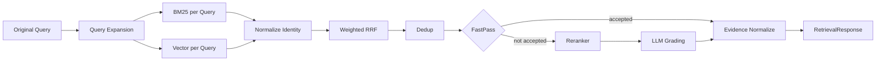

# Retrieval System 与质量 Pipeline 设计 v1.1

> 上游：`00`、`01`  
> 范围：一次 `knowledge_search` 如何产生高质量内部 Evidence。Agent 循环和 MCP 外部证据不属于本文。

---

## 1. 定位

Retrieval System 负责：

> **给定一次搜索意图，在可控成本内尽量召回并保留正确 Evidence。**

它不判断任务是否完成，也不生成最终回答。

V1 作为 RAG Extension 内的 in-process `RetrievalService` 实现，通过接口预留远程部署能力。

---

## 2. Pipeline



FastPass 是结构固定、策略可关闭的质量阶段，不是一个固定分数阈值。

---

## 3. RetrievalService 边界

输入：

```text
original_query
resolved_query
metadata_filter
temporal_constraint
top_k
profile_version
request_context
```

输出：

```text
evidence[]
retrieval_run_id
trace_summary
degraded
errors[]
profile_version
```

内部实现可以变化，Tool Contract 不暴露 Retriever 私有参数。

---

## 4. Query Expansion

每次内部知识搜索都执行 Query Expansion，不使用 `auto` 跳过策略。

输出固定为：

```text
Original Query
+ 1~3 Semantic Variants
```

规则：

- Original 必须保留；
- Variant 不重复 Original；
- 保留实体、数字、日期、版本号、产品名和 ID；
- 只改变语义表达或补足明确上下文；
- 不引入用户未提供的新事实；
- 不生成大量关键词碎片；
- 失败、超时或非法输出时仅使用 Original；
- 记录 Prompt、Model、Variant 和失败原因。

Query Expansion 只扩大 Recall，不负责 Agent 多轮 Search Strategy。

---

## 5. Query 权重

每个 Query 带权重：

```text
original_query_weight > variant_weight
```

具体值属于 `RetrievalProfile`，通过 Evaluation 校准。架构不写死数值。

所有后续 Reranker 和 LLM Grading 都以 Original Query 为相关性目标，避免 Variant 改变问题含义。

---

## 6. Retriever

V1：

- BM25 Retriever；
- Vector Retriever。

二者由 External Knowledge Base 提供原始搜索能力。RAG Extension 负责调用编排和结果规范化。

初始来源权重相等。Retriever Failure 彼此隔离。

KG 是 Future Retriever，只有在公开评估证明增益且 External KB 提供稳定接口后加入。

---

## 7. Candidate Identity

不同 Query 和 Retriever 返回同一 Chunk 时，必须聚合为一个 Candidate。

稳定身份优先级：

```text
chunk_id
→ document_id + chunk_locator + document_version
→ canonical_uri + content_hash
```

聚合记录：

```text
matched_queries
matched_retrievers
per_query_rank
per_retriever_rank
rrf_contributions
exact_match_signals
metadata_matches
```

---

## 8. Weighted RRF

不直接相加 BM25 Score 与 Vector Similarity。

概念公式：

```text
rrf(candidate) = Σ query_weight × retriever_weight / (k + rank)
```

要求：

- 使用 Rank 而不是异构 Raw Score；
- Original Query Contribution 可单独审计；
- 每个贡献项进入 Retrieval Trace；
- `k` 和权重由 Profile 管理；
- 不把 RRF Score 解释为概率或置信度。

---

## 9. Dedup

融合后按以下信号去重：

- Chunk Identity；
- Document + Locator；
- Content Hash；
- 高度重叠正文。

去重必须合并 Provenance，不能丢失“多个 Query / Retriever 同时命中”的强信号。

---

## 10. FastPass

FastPass 只在存在可解释的强信号时跳过昂贵阶段。

可用信号：

- BM25 与 Vector 同时高排名命中；
- Original 与多个 Variant 同时命中；
- 强实体/编号/版本精确匹配；
- Metadata 和时间条件完全满足；
- Candidate 身份与来源完整；
- 没有明显冲突或过期信号。

禁止：

- `RRF score >= 0.7`；
- 将 Vector Cosine 与 BM25 Score 混成统一 confidence；
- 因候选数量少就认定高质量；
- 在未评估 False Positive 前默认开启激进 FastPass。

FastPass 输出：

```text
accepted: bool
reason_codes[]
accepted_candidate_ids[]
```

---

## 11. Reranker

输入 Original Query 和融合候选正文，输出可比较的相关性排序。

要求：

- 有明确输入长度限制；
- 长 Candidate 使用受控片段；
- 记录 Model/Version；
- 超时或失败回退到 Fusion 顺序；
- 不改变 Candidate Provenance。

---

## 12. LLM Grading

Grading 是 Retrieval 相关性与可用性审查，不是 Agent Sufficiency。

它判断：

- 是否直接相关；
- 是否只有背景关系；
- 是否过期；
- 是否内容不足或噪声过高；
- 是否存在明显冲突信号。

结构化输出至少包含：

```text
candidate_id
accepted
reason_code
score
```

`score` 只在同一 Grader/Profile 内使用。Grader 失败回退到 Reranker 结果。

---

## 13. Evidence Normalize

通过质量阶段的 Candidate 转为统一 Evidence：

```text
candidate identity
→ evidence_id

bounded content
→ evidence.content

retriever/query/fusion/grading
→ provenance

document/index/version/time
→ version fields
```

Retrieval System 不生成 Citation 文本，只生成可引用 Evidence。

---

## 14. 时间约束

V1 支持：

- `published_after / before`；
- `updated_after / before`；
- publish/update time 排序信号；
- 对“最新”问题保留时间 Provenance。

不实现独立 Temporal Reranker。

---

## 15. 降级

```text
Query Expansion failure → Original only
BM25 failure            → Vector only
Vector failure          → BM25 only
Fusion partial input    → Available retriever results
FastPass failure        → Run Reranker
Reranker failure        → Fusion order
Grader failure          → Reranker order
Both retrievers fail    → Retrieval failure, no Evidence
```

`zero_result` 与 `retrieval_failure` 必须分开。

---

## 16. Retrieval Trace

每次调用生成 `retrieval_run_id`，记录：

- Original / Resolved Query；
- Variant 与权重；
- Retriever 请求、延迟、状态；
- Raw Rank 和 Candidate Identity；
- RRF Contribution；
- Dedup；
- FastPass Reason；
- Reranker / Grader 版本与结果；
- Evidence；
- Degradation；
- Profile Version。

完整正文不写入 Span Attribute；详情保存为结构化 Trace 或 Artifact。

---

## 17. RetrievalProfile

```yaml
profile_id: baseline-v1
query_expansion:
  enabled: true
  max_variants: 3
retrievers:
  bm25: { enabled: true }
  vector: { enabled: true }
fusion:
  type: weighted_rrf
fastpass:
  enabled: false
reranker:
  enabled: true
grading:
  enabled: true
```

示例只表达结构。实际参数通过评估确定，并以不可变配置哈希绑定运行。

---

## 18. Evaluation 与消融

至少支持：

```text
BM25 only
Vector only
BM25 + Vector + RRF
+ Query Expansion
+ Reranker
+ Grading
+ FastPass
```

对比重点：

- Recall/Hit@10；
- Gold Evidence Retention；
- NDCG 或 MRR；
- 各阶段 Precision/Recall 变化；
- P95 Latency 与 Token Cost。

FastPass 必须单独评估误放行。

---

## 19. 扩展 KG

Future KG Retriever 必须：

- 实现相同 Retriever Contract；
- 输出统一 Candidate；
- 通过 Rank 参与 Fusion；
- 不改变 Agent Action；
- 使用 KG Incremental Evidence Recall Gain 和 Multi-hop 指标证明增益。

没有增益证据前不进入 V1。

---

## 20. 验收

1. 每次内部搜索都有 Original + 受控 Variant 或明确降级；
2. Raw Score 不跨 Retriever 直接比较；
3. Original Query 权重大于 Variant；
4. Rerank/Grade 以 Original Query 为准；
5. FastPass 无固定 0.7 规则；
6. Candidate Provenance 不因去重丢失；
7. 所有阶段可降级且可追踪；
8. 双 Retriever 全失败时不返回事实 Evidence；
9. Profile 可复现；
10. 消融实验可独立关闭各阶段。

