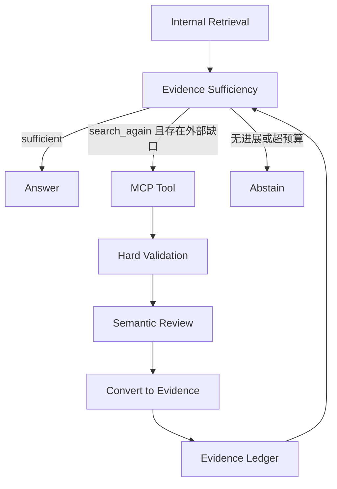

# MCP 外部补充证据设计 v1.1

> 文档编号：09  
> 上游文档：`00-architecture-baseline.md`、`02-agent-design.md`、`04-interface-specification.md`、`06-reliability-design.md`  
> V1 实例：ProfessionalWiki MediaWiki MCP Server，默认中文 Wikipedia，只读。  
> 本文只固定架构职责与安全边界；精确工具参数、Adapter 字段映射和部署配置在实现该阶段时确定。

---

## 1. 定位

MCP 在 `knowledge` 模式中是 **External Supplemental Evidence Source（外部补充证据源）**。

它不是内部 BM25、Vector 检索的第三路召回，不参与内部 Fusion、Reranker 或 LLM Grading。外部结果经过独立证据化后，才与内部 Evidence 一起进行充分性判断、冲突处理和引用。



---

## 2. 与 DeerFlow 的职责边界

本项目直接复用 DeerFlow 已有 MCP 能力：

- Server 配置和连接；
- Tool 加载、发现与调用；
- Transport、认证、超时和基础异常处理；
- Deferred Tool、`tool_search` 和原有路由提示；
- `general` 模式下的普通 MCP 行为。

RAG Extension 只负责证据语义：

- 登记哪些 MCP 来源和 Tool 可以提供严格知识证据；
- 为 Agent 暴露受控的证据包装工具；
- 归一化、硬校验、去重、配额和语义 Review；
- 转换为统一 Evidence 并登记 Ledger；
- 执行来源优先级、权威性、冲突和引用策略。

因此 `rag_extension/mcp_evidence/` 是“证据适配层”，不是第二套 MCP 框架。不得在其中重建通用 MCP Client、Session Pool、Router 或 Executor。

---

## 3. 触发规则

V1 支持两种触发：

1. **内部证据不足**：Agent 根据 `reason` 和当前缺失信息，在 `search_again` 时选择已登记的外部来源；
2. **用户显式要求**：用户明确要求查询 Wikipedia 时，可直接调用对应证据工具，无需先证明内部证据不足。

默认不调用 MCP，也不扫描或调用所有 MCP。V1 只有一个 MediaWiki 来源，不建设多 MCP 自研 Discovery/Router；未来增加来源时，优先复用 DeerFlow 的 Tool Discovery，再在证据登记信息上增加轻量选择策略。

---

## 4. V1 MediaWiki 能力

底层复用 MediaWiki MCP Server 的页面搜索、页面读取和版本信息能力。面向 Agent 只暴露两个稳定的逻辑工具：

- `wikipedia_search`：寻找候选页面和简短相关信息；
- `wikipedia_read`：读取指定页面的相关正文，并保留可引用来源信息。

包装工具与底层 MCP Tool 的精确映射、请求参数和 `page_ref` 结构属于开发期决策，不在本架构阶段锁死。

V1 约束：

- 默认中文 Wikipedia；
- 中文结果无可用证据时，最多进行一次英文 Wikipedia 回退；
- 只读，不开放编辑、用户、权限或站点管理能力；
- Wikipedia 默认 `authority = MEDIUM`；
- 页面完整长文本作为 Artifact，模型只读取与问题相关的段落；
- 页面标题、URL、语言、修订信息和获取时间应进入 Provenance。

---

## 5. 证据化流水线

```text
MCP Raw Result
→ Source Adapter
→ Hard Validation
→ Dedup / Quota / Length Control
→ Structured Semantic Review
→ Evidence Conversion
→ Evidence Ledger
```

### 5.1 Source Adapter

Adapter 将 MCP 私有返回格式转换为内部候选结构。候选至少能表达：来源、标题、相关内容、稳定 URL、内容类型、语言、时间或修订信息，以及必要的原始元数据。

内部后续组件不直接依赖 MediaWiki MCP 的私有响应 Schema。

### 5.2 Hard Validation

由确定性代码完成：

- Schema、空结果和内容类型校验；
- URL 与来源登记校验；
- 数量、长度和总 Token 限制；
- 基于页面标识、URL 或内容哈希去重；
- 超时、异常和不完整结果标记；
- 清理控制字段，并把正文始终视为外部数据。

MCP 正文中的任何指令都不能修改 System Prompt、Agent Policy、Tool Registry 或 Evidence 规则。

### 5.3 Semantic Review

硬校验通过后，使用固定的结构化 LLM Task 判断候选是否直接补齐当前信息缺口。Reviewer 不是自由 Agent，不调用其他 Tool。

建议输出只保留：

- `relevant`；
- `score`；
- `covered_aspects`；
- `reason_code`。

`review_score` 只表示当前问题下的相关性，不与内部 Reranker 分数比较，也不直接表示来源可信度。

### 5.4 Evidence Conversion

合格候选转换为系统统一 `Evidence`。除通用字段外，应保留：

- `source_type = MCP`；
- 来源名称与页面标题；
- 稳定 URL；
- 页面语言和修订信息；
- `retrieved_at` 与 `content_hash`；
- `authority`、`retrieval_priority` 和完整 Provenance。

只有转换成功并被 RagGuard 登记的内容可以支撑 `knowledge` 模式事实性结论。

---

## 6. 选择优先级与冲突

外部证据保留三个独立概念：

- `review_score`：是否与当前缺口相关；
- `retrieval_priority`：上下文预算紧张时的选择优先级；
- `authority`：来源冲突时的可信参考。

V1 不把三者合成为统一总分。默认企业知识场景中，内部正式知识文档通常优先于通用 Wikipedia；仍需结合发布时间、修订时间、直接性和完整性判断。

发现冲突时，不新增 `CONFLICTED` 状态机。冲突信息作为 Evidence Sufficiency 的 `reason` 和 Trace 记录，Agent 可继续搜索、读取完整来源或在答案中明确披露；无法可靠解决时拒答。

---

## 7. 调用历史与预算

每次 Agent Run 保存外部调用历史，至少能识别来源、查询、缺失信息和已返回页面，避免相同或高度相似查询反复调用同一来源。

预算由 RetrievalProfile 管理，至少覆盖：

- 单轮外部调用数；
- 整次运行的外部调用数；
- 单次结果数；
- 外部证据总 Token；
- 超时和有限重试。

具体默认值必须通过评测确定，架构文档不预设伪精确数值。

---

## 8. 失败与降级

- MCP 超时、无结果或 Review 无合格项时，内部证据仍可继续使用；
- 单次英文回退失败后不再循环切换语言；
- 外部来源失败不得导致整个对话 Runtime 失败；
- 若内部证据不足且外部补充也失败，Agent 根据剩余预算选择其他内部搜索或拒答；
- 外部结果部分成功时仅登记通过校验的 Evidence，并在 Trace 中标记降级。

不得把“Tool 调用成功”等同于“获得了可引用证据”。

---

## 9. 引用与原文返回

最终答案引用 MCP Evidence 时，应让用户清楚看到来源类型、来源名称、页面标题和 URL。页面修订信息应保留在 Provenance 中，以支持复现。

完整页面正文不直接塞入 LLM Context：

```text
相关段落 → ToolMessage / Evidence Context
完整正文 → Artifact / 用户直接获取
```

这与内部 `document_read` 的长文处理规则一致。

---

## 10. 安全边界

1. MCP 内容始终是外部不可信数据，不是指令；
2. 原始证据 Tool 不绕过包装层直接向 `knowledge` 模式 Agent 暴露；
3. 证据 Tool 只读，并设置结果、Token、调用次数和时间预算；
4. Citation 只能引用 Ledger 中已登记 Evidence；
5. Skill 可以编排证据工具，但 Skill 本身不是 Evidence；
6. MCP 不具有注册新 Tool、修改策略或扩大访问范围的权限。

---

## 11. 预留扩展点

未来增加 GitHub、Arxiv 或其他 MCP 来源时，可新增来源登记和 Adapter，并复用同一证据化流水线。只有出现多个实际来源且评测证明有必要时，才增加多来源选择或并行策略。

以下细节统一推迟到实现 MediaWiki 阶段：

- MCP Server 的最终版本和部署方式；
- 底层 Tool 名称与参数映射；
- Adapter 的精确候选 Schema；
- 页面引用标识和分段策略；
- Timeout、结果数、阈值和 Token 默认值；
- 中文与英文页面映射细则。

---

## 12. V1 验收

MCP 外部证据能力完成时应满足：

1. 不调用 MCP 时，内部 RAG 行为不变；
2. 内部证据不足或用户显式要求时，可调用 Wikipedia；
3. MCP 原始结果不能绕过校验进入 Ledger；
4. 外部证据不参与内部 Fusion/Reranker 分数比较；
5. 中文无可用结果时最多一次英文回退；
6. 完整页面以 Artifact 返回，模型只读相关段落；
7. Wikipedia 失败后系统可继续内部流程或明确拒答；
8. 最终引用可定位到来源页面并保留修订 Provenance。
